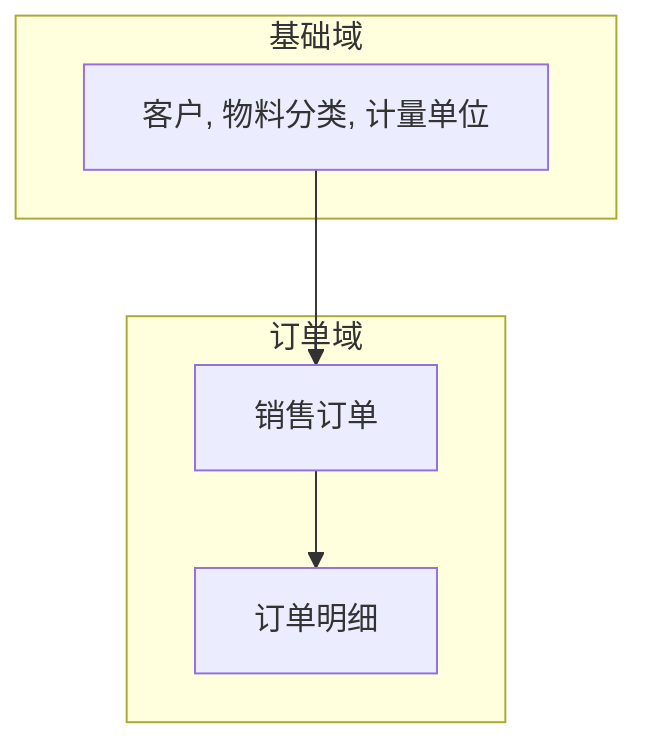

# 领域模型汇总

> 最后更新：{日期}

---

## 1 领域全景图

---

## 2 聚合根索引

| 聚合根 | 所属域 | 核心职责 | 关键状态 |
|--------|--------|----------|----------|
| **Customer** | 基础域 | 管理客户信息、联系人、银行账户 | ACTIVE → INACTIVE |
| **SalesOrder** | 订单域 | 管理订单从创建到交付的全生命周期 | DRAFT → CONFIRMED → DELIVERED |

---

## 3 演进记录

| 日期 | 变更内容 | 涉及领域 |
|------|----------|----------|
| 2025-04-21 | 初始化领域模型结构 | customer, order |