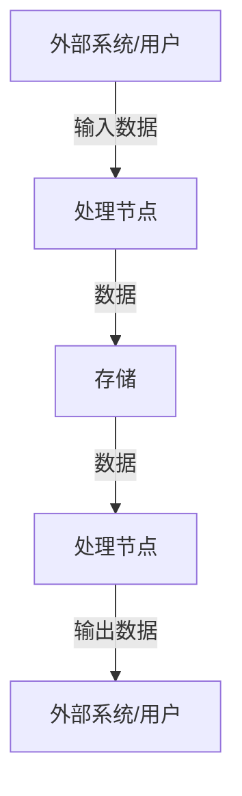
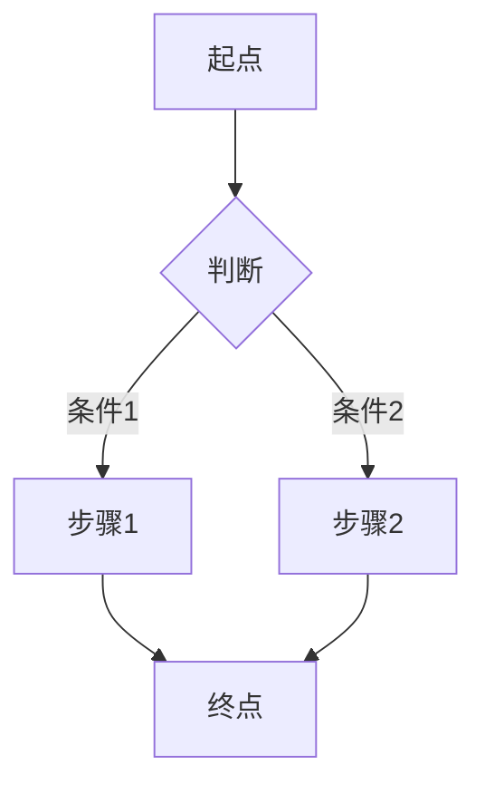

# MDD 设计推演

本 skill **不自动触发**，需用户通过 `/m-design` command 调用。

---

## 核心理念

```
规约先行 → 需求明确 → 角色协作 → 方案输出 → 用户确认 → 设计更新
```

---

## 输入

- 领域名称：由 command 传入
- 业务描述：用户提供的业务需求描述

---

## 步骤

### Step 1：读取设计原则

读取 `config/rules.md`，明确 DDD 建模规约：

**设计原则**：
- DDD 建模语言（实体、值对象、聚合、领域事件）
- 领域边界划分（限界上下文、聚合边界）
- 统一语言定义（术语表）
- 建模设计约束（聚合间引用、一致性边界）

---

### Step 2：确定角色视角

读取 `config/roles.md`，确定可参与设计的角色。

**角色信息提取**：
- 角色名：roles.md 中定义的角色
- 视角：该角色的专业视角
- 关注点：该角色评审时的关注点

**评审维度**：根据 roles.md 中每个角色的「关注点」动态确定

---

### Step 3：明确需求

#### 3.1 理解整理

将用户的自然语言输入理解整理，提取：
- 核心实体
- 关联关系
- 状态定义
- 业务规则
- 用例场景

**用户原话保留**：
> "{用户原始描述}"

#### 3.2 不确定项处理

**如果 AI 不确定**：使用 **AskUserQuestion** 询问用户
**如果用户不确定**：记录到「待定任务清单」

#### 3.3 选定参与角色

根据业务场景和 `config/roles.md` 中定义的角色，选定参与设计的角色：

**选定规则**：
- 根据场景特征匹配角色的「视角」属性
- 涉金额/合规场景 → 选择有合规审计视角的角色
- 涉业务流程场景 → 选择有业务流程视角的角色
- 不确定时使用 **AskUserQuestion** 询问用户

---

### Step 4：角色协作评审

#### 4.1 AI 分析方案

根据专业知识分析解决方案（使用内置模板）：

```markdown
## AI 分析方案

### 术语表
- {从需求提取的术语}

### 实体设计
- {实体列表及属性}

### 聚合边界
- {聚合划分}

### 状态流转
- {状态机设计}

### 业务规则
- {规则清单}

### 数据流图
- {数据流转设计}

### 业务场景
- {场景列表}
```

#### 4.2 逐角色评审

每个角色从自己的视角分析方案，提出意见：

**评审格式**：

```markdown
## 角色：{角色名}

### 评审视角
{该角色的关注点}

### 方案分析
| 维度 | 评价 | 意见 |
|------|------|------|
| {维度1} | ✓/✗/△ | {具体意见} |

### 补充建议
- {该角色提出的补充建议}

### 风险提示
- {该角色发现的风险点}
```

**评审维度**：根据 roles.md 中该角色的「关注点」属性确定

---

### Step 5：输出方案到 solution

将完整方案输出到 `solution/{domain}/solution.md`：

```markdown
# 设计方案

## 一、需求概述
{整理后的需求摘要}

## 二、用户原话
> "{用户原始描述}"

## 三、AI 分析方案
{AI 提出的设计方案}

## 四、角色评审汇总
{各角色的评审意见汇总}

## 五、综合方案
{综合各方意见后的最终方案}

## 六、待定任务
{未确定的任务清单}

## 七、设计产出预览
{即将输出的 model.md 内容预览}
```

---

### Step 6：询问用户确认

使用 **AskUserQuestion** 询问用户：

```
方案已输出到 solution/{domain}/solution.md

是否将方案更新到领域模型目录 domain/{domain}/model.md？
```

**选项**：
- 确认更新 —— 执行 Step 7
- 暂不更新 —— 方案保留在 solution 目录
- 修改方案 —— 根据用户意见调整方案

---

### Step 7：更新设计

用户确认后，将方案更新到 `domain/{domain}/model.md`：

**使用内置模板**（见下方）

---

## 内置模板：model.md

领域模型整合文件，包含 7 要素：

```markdown
# {领域名称} 领域模型

> 最后更新：{日期}

---

## 一、术语表

| 术语 | 英文名 | 定义 | 关联术语 |
|------|--------|------|----------|
| {中文} | {English} | {定义} | {关联术语} |

---

## 二、实体定义

### {实体名}

| 属性 | 类型 | 必填 | 说明 |
|------|------|------|------|
| id | string | ✓ | 唯一标识 |
| {属性} | {类型} | {必填} | {说明} |

---

## 三、聚合边界

### 聚合：{聚合名}

- 聚合根：{实体名}
- 内部实体：{实体列表}
- 值对象：{值对象列表}

### 聚合间引用

| 聚合A | 聚合B | 引用方式 |
|-------|-------|----------|
| {聚合名} | {聚合名} | {聚合B}Id |

---

## 四、状态机

### 状态定义

| 状态 | 编码 | 是否终态 | 说明 |
|------|------|----------|------|
| {状态名} | {编码} | {是/否} | {说明} |

### 状态流转

| 当前状态 | 触发事件 | 目标状态 | 前置条件 |
|----------|----------|----------|----------|
| {状态A} | {事件} | {状态B} | {条件} |

### 异常流转

| 当前状态 | 异常场景 | 处理方式 | 目标状态 |
|----------|----------|----------|----------|
| {状态A} | {异常} | {处理} | {状态B} |

---

## 五、业务规则

### 红线规则（不可绕过）

| 规则ID | 规则描述 | 来源 |
|--------|----------|------|
| R01 | {规则内容} | 用户原话 |

### 业务规则

| 规则ID | 规则描述 | 来源 | 适用场景 |
|--------|----------|------|----------|
| R02 | {规则内容} | {角色} | {场景} |

---

## 六、数据流图

### {数据流名称}



| 数据流 | 数据内容 | 来源 | 目的地 |
|--------|----------|------|--------|
| {流名} | {数据} | {来源} | {目的地} |

---

## 七、业务场景（用例）

### 场景：{场景名}

**触发条件**：{条件}

**参与者**：{角色列表}

**流程**：



**涉及实体**：{实体列表}

**状态变化**：{状态A} → {状态B}

**规则约束**：R01, R02

---

## 八、待定项

| # | 待定内容 | 来源 | 状态 |
|---|----------|------|------|
| 1 | {待定} | {用户反馈} | 待确认 |
```

---

## 输出

完成后输出：
```
设计推演完成：

方案文件：
- solution/{domain}/solution.md

设计文件（如已确认）：
- domain/{domain}/model.md    —— 领域模型（7要素整合）
```

---

## 约束

- **规约遵循**：推演必须遵循 `config/rules.md` 中的 DDD 建模规约
- **角色必选**：必须选定至少一个角色参与评审
- **待定记录**：不确定项必须记录到待定任务清单
- **用户确认**：更新设计前必须经用户确认
- **聚合间引用**：通过 ID 引用，不直接持有对象
- **单文件整合**：设计输出整合到 `domain/{domain}/model.md`