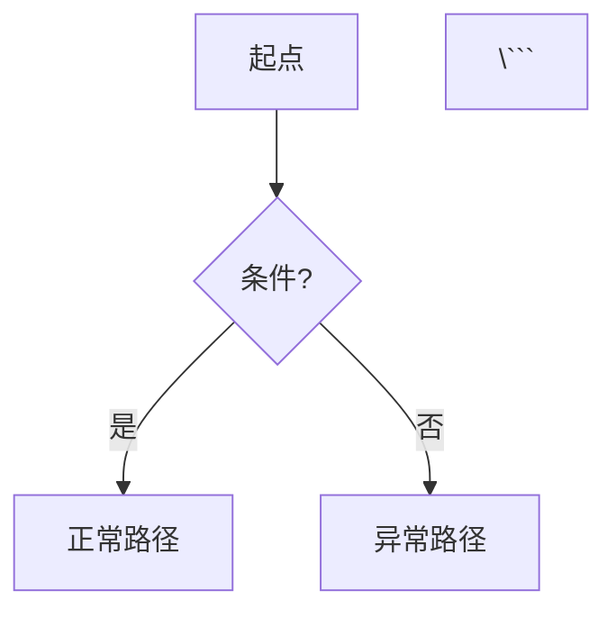

# MDD 设计推演

本 skill **不自动触发**，需用户通过 `/m-design` command 调用。

---

## 核心理念

```
inputs/  = 原始需求记录（理解层）—— 用户说了什么
outputs/ = 设计推演结果（解空间）—— 应该怎么设计
```

---

## 输入

- 原始需求记录：`inputs/{domain}/input.md`
- 领域名称：由 command 传入

---

## 步骤

### Step 1：读取原始需求

读取 `inputs/{domain}/input.md`，提取已整理的内容：
- 核心实体
- 关联关系
- 状态定义
- 业务规则
- 用例场景

---

### Step 2：角色协作推演

多角色视角补充遗漏场景：

| 角色 | 关注角度 | 输出内容 |
|------|----------|----------|
| 业务分析师 | 用例完整性、边界条件 | 遗漏场景、异常分支 |
| 财务审核员 | 合规性、金额计算 | 涉金额时的风险提示 |
| 测试工程师 | 并发、时序、数据一致性 | 状态死锁、孤儿状态 |

**参与规则**：
- 涉金额 → 财务审核员参与
- 有状态流转 → 测试工程师参与
- 默认 → 业务分析师参与

---

### Step 3：设计推演

#### 3.1 model.md —— 业务模型

扩充 `input.md` 中的实体定义：

```markdown
## 实体

### {实体名}
| 属性 | 类型 | 必填 | 说明 |
|------|------|------|------|
| id | string | ✓ | 唯一标识 |
| status | enum | ✓ | 状态 |

## 关联

- {实体A} → {实体B}: 1:N
  - 外键：{属性名}
```

#### 3.2 states.md —— 状态机

补充状态流转和异常分支：

```markdown
## 状态定义

| 状态 | 编码 | 是否终态 |
|------|------|----------|
| 待支付 | PENDING | 否 |

## 正常流转

- 待支付 → [支付成功] → 已支付
  - 前置：无欠款、无风控拦截

## 异常流转（推演）

- 待支付 → [并发支付] → 支付冲突
  - 场景：同一订单同时发起多次支付
```

#### 3.3 rules.md —— 业务规则

分类规则并标注来源：

```markdown
## 用户红线（input.md 提取）

- R01: {用户明确的约束}
  - 来源：用户原话

## 推演规则（角色补充）

- R02: {推演发现的规则}
  - 来源：业务分析师
  - 场景：{触发场景}

## 风险提示

- [警告] {可能的风险}
```

#### 3.4 flows.md —— 用例流程图

```markdown
## {用例名}



---

### Step 4：风险检测

检查以下风险点，如有问题追加到 `rules.md`：

| 风险类型 | 检查内容 |
|----------|----------|
| 状态死锁 | 无法到达终态 |
| 孤儿状态 | 无法到达的状态 |
| 红线击穿 | 规则可被绕过 |
| 并发冲突 | 竞态条件 |

---

## 输出

产出文件：
- `outputs/domain/{domain}/model.md`
- `outputs/domain/{domain}/states.md`
- `outputs/domain/{domain}/rules.md`
- `outputs/domain/{domain}/flows.md`

---

## 约束

- `inputs/` 已由 command 写入，只读
- `outputs/` 推演后覆盖写入
- 推演内容必须标注来源（用户原话/角色推演）