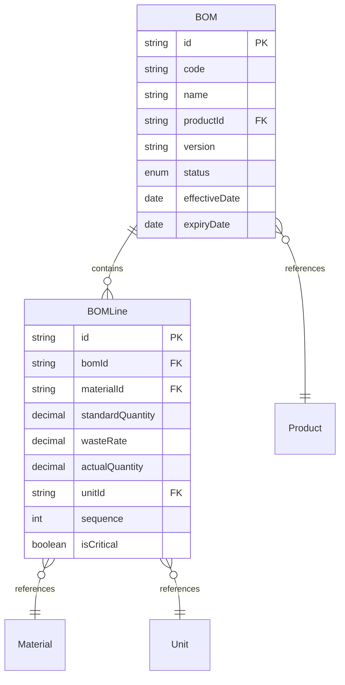
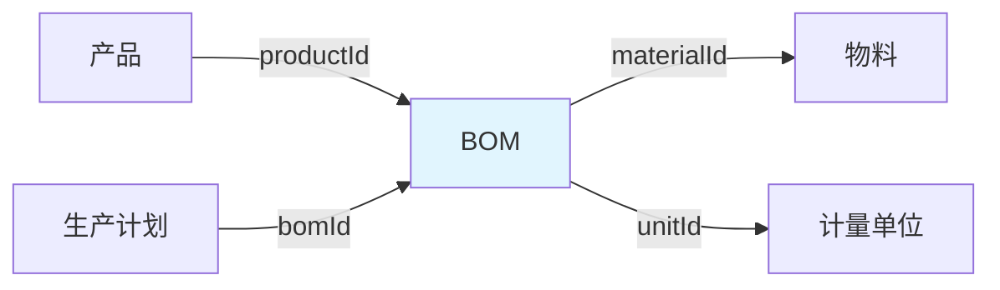
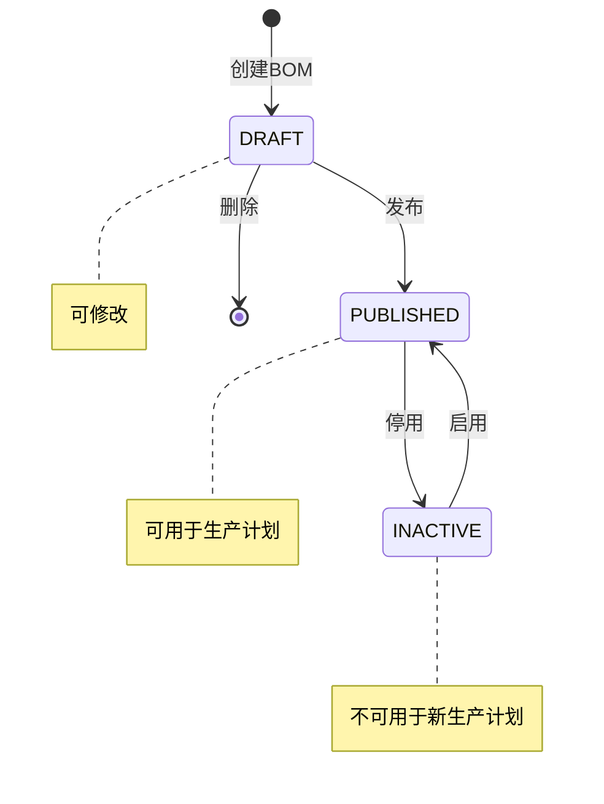
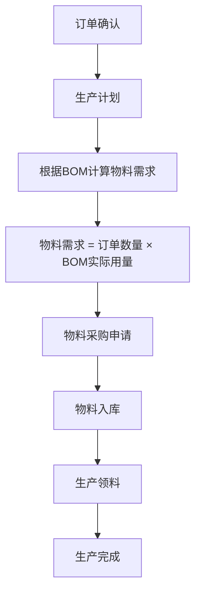

# BOM领域模型

> 限界上下文：catalog
> 子域类型：支撑域
> 聚合根：BOM
> 最后更新：2025-04-21

---

## 1 术语表

> 仅在用户澄清概念时记录

| 术语 | 定义 | 澄清来源 |
|------|------|----------|
| {概念} | {定义} | {用户原话} |

---

## 2 实体定义

### 实体关系图

### BOM（聚合根）

| 属性 | 类型 | 必填 | 说明 |
|------|------|------|------|
| id | string | ✓ | 唯一标识 |
| code | string | ✓ | BOM编码（系统自动生成） |
| name | string | ✓ | BOM名称（关联产品名称） |
| productId | string | ✓ | 产品ID（关联SKU） |
| version | string | ✓ | BOM版本号（如 V1.0） |
| status | enum | ✓ | BOM状态（DRAFT/PUBLISHED/INACTIVE） |
| effectiveDate | date | | 生效日期 |
| expiryDate | date | | 失效日期 |
| remark | string | | 备注 |
| createdAt | datetime | ✓ | 创建时间 |
| updatedAt | datetime | | 更新时间 |

### BOM明细（内部实体）

| 属性 | 类型 | 必填 | 说明 |
|------|------|------|------|
| id | string | ✓ | 唯一标识 |
| bomId | string | ✓ | BOMID（聚合内引用） |
| materialId | string | ✓ | 物料ID |
| standardQuantity | decimal | ✓ | 标准用量（单件产品所需物料数量） |
| wasteRate | decimal | | 损耗率（如 5%，即 0.05） |
| actualQuantity | decimal | ✓ | 实际用量 = 标准用量 × (1 + 损耗率) |
| unitId | string | ✓ | 计量单位ID |
| sequence | int | ✓ | 序号（物料在BOM中的顺序） |
| isCritical | boolean | | 是否关键物料 |
| substituteMaterials | array | | 替代物料列表（materialId + priority + quantity） |
| remark | string | | 备注 |

---

## 3 聚合边界

**聚合：BOM聚合**

- 聚合根：BOM
- 内部实体：BOM明细（可多个）

---

## 4 上下游关系图

**关系说明：**

- **上游：**产品 → BOM（BOM关联产品）
- **下游：**BOM → 物料（BOM明细引用物料）
- **下游：**BOM → 计量单位（BOM明细引用计量单位）
- **下游：**生产计划 → BOM（生产计划根据BOM计算物料需求）

---

## 5 状态图

---

## 6 业务规则

| 规则ID | 规则描述 | 适用场景 |
|--------|----------|----------|
| R01 | BOM编码系统自动生成 | 创建BOM |
| R02 | BOM必须关联产品 | 创建BOM |
| R03 | BOM明细必须关联物料 | 创建BOM明细 |
| R04 | 实际用量 = 标准用量 × (1 + 损耗率) | 计算物料需求 |
| R05 | 替代物料优先级：1=首选，2=次选 | 配置替代物料 |
| R06 | BOM发布前需检查BOM明细完整性 | 发布BOM |
| R07 | BOM停用前需检查是否在生产订单中使用 | 停用BOM |

---

## 7 补充流程图

> 仅在复杂领域设计

---

## 8 用例

| 用例 | 角色 | 操作 | 目标 |
|------|------|------|------|
| 创建BOM | 生产跟单员 | 创建新产品的物料清单 | 为生产准备物料清单 |
| 修改BOM | 生产跟单员 | 调整物料用量、损耗率 | 更新物料清单配置 |
| 发布BOM | 业务经理 | 发布BOM使其生效 | 使BOM可用于生产计划 |
| 停用BOM | 业务经理 | 停用BOM | 停止使用该BOM |
| 查询BOM成本 | 业务经理 | 查询物料成本总和 | 评估产品成本 |