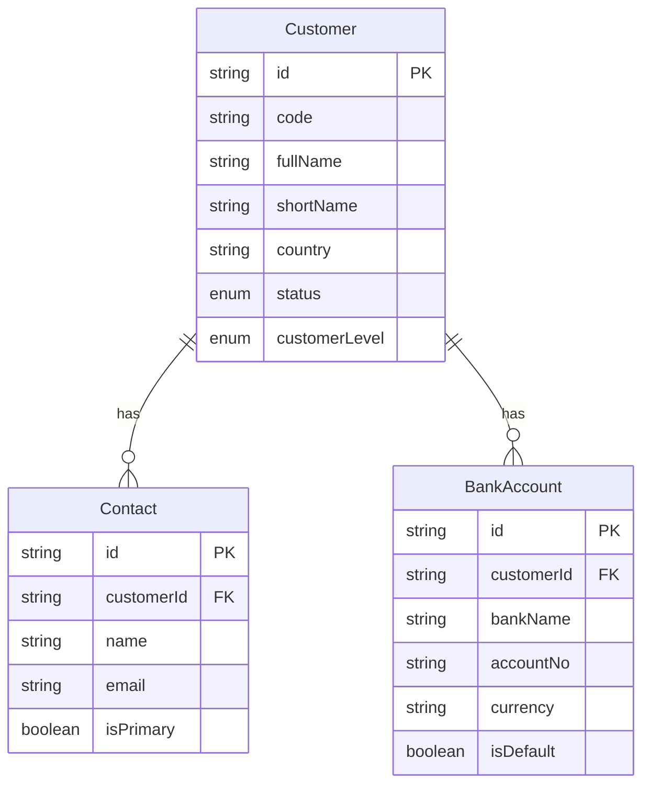
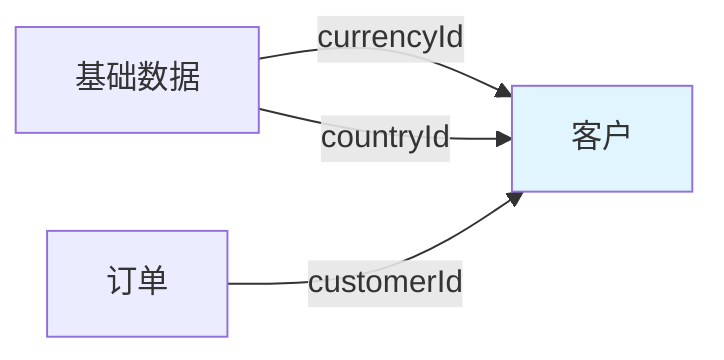
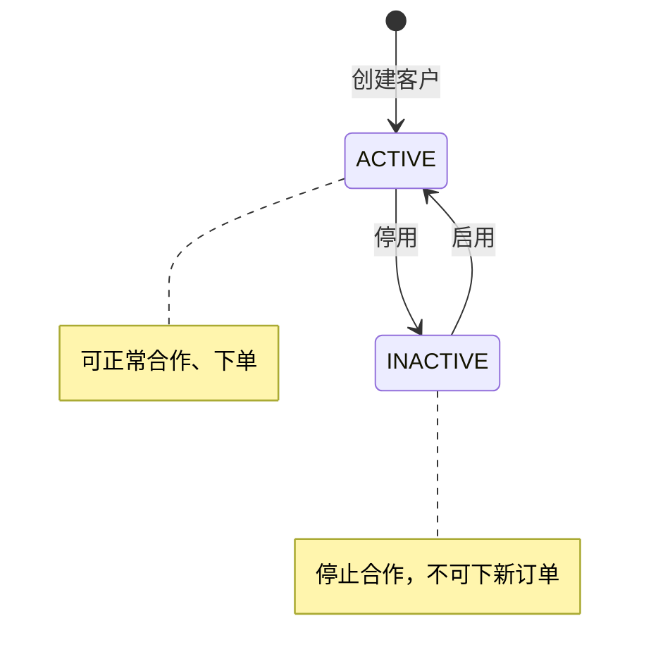

# 客户领域 - 客户模型

> 最后更新：2025-04-21

---

## 1 术语表

> 仅在用户澄清概念时记录

| 术语 | 定义 | 澄清来源 |
|------|------|----------|
| {概念} | {定义} | {用户原话} |

---

## 2 实体定义

### 实体关系图

### 客户（聚合根）

| 属性 | 类型 | 必填 | 说明 |
|------|------|------|------|
| id | string | ✓ | 唯一标识 |
| code | string | ✓ | 客户编码（系统自动生成，CUST001） |
| fullName | string | ✓ | 客户全称 |
| fullNameEn | string | | 英文全称 |
| shortName | string | ✓ | 简称 |
| country | string | ✓ | 国家 |
| phone | string | | 电话 |
| companyType | string | | 公司类型（品牌公司/贸易公司/零售商） |
| address | object | | 地址（结构化属性：street、city、state、postcode、country） |
| addressEn | object | | 英文地址（结构化属性） |
| developChannel | string | | 开发渠道 |
| customerLevel | enum | | 客户等级（VIP/普通/潜在） |
| paymentTerms | string | | 价格条款（FOB/CIF/DDP等） |
| paymentMethod | string | | 付款方式（T/T/L/C等） |
| selfOwnedBrand | boolean | | 是否自营品牌 |
| brandList | string[] | | 自营品牌列表 |
| remark | string | | 备注 |
| status | enum | ✓ | 客户状态（ACTIVE/INACTIVE） |
| createdAt | datetime | ✓ | 创建时间 |

### 联系人（内部实体）

| 属性 | 类型 | 必填 | 说明 |
|------|------|------|------|
| id | string | ✓ | 唯一标识 |
| customerId | string | ✓ | 客户ID（聚合内引用） |
| name | string | ✓ | 联系人姓名 |
| phone | string | | 联系电话 |
| email | string | ✓ | 联系人邮箱 |
| isPrimary | boolean | | 是否主联系人 |

### 银行账户（内部实体）

| 属性 | 类型 | 必填 | 说明 |
|------|------|------|------|
| id | string | ✓ | 唯一标识 |
| customerId | string | ✓ | 客户ID（聚合内引用） |
| bankName | string | ✓ | 收款银行 |
| accountNo | string | ✓ | 账号 |
| swiftCode | string | | Swift Code |
| bankAddress | object | | 银行地址（结构化属性） |
| currency | string | | 结算币种 |
| isDefault | boolean | | 是否默认账户 |

---

## 3 聚合边界

**聚合：客户聚合**

- 聚合根：客户
- 内部实体：联系人（可多个）、银行账户（可多个）

---

## 4 上下游关系图

**关系说明：**

- **上游：**基础数据 → 客户（客户币种、国家）
- **下游：**订单 → 客户（订单关联客户）

---

## 5 状态图

**状态简化说明：**

原4个状态（潜在客户、活跃客户、暂停合作、注销）简化为2个状态（启用、停用），用客户等级字段区分客户类型。

---

## 6 业务规则

| 规则ID | 规则描述 | 适用场景 |
|--------|----------|----------|
| R01 | 客户编码系统自动生成 | 创建客户 |
| R02 | 客户必须有至少一个主联系人 | 创建客户 |
| R03 | 客户必须有至少一个银行账户 | 首次下单前 |
| R04 | 客户状态为停用时不能下新订单 | 创建订单 |
| R05 | 客户停用前必须无未完成订单 | 停用客户 |

---

## 7 补充流程图

> 仅在复杂领域设计

（暂无）

---

## 8 用例

| 用例 | 角色 | 操作 | 目标 |
|------|------|------|------|
| 创建客户 | 业务经理 | 创建新客户信息 | 为订单准备客户基础数据 |
| 修改客户 | 业务经理 | 更新客户联系方式、地址等信息 | 维护客户信息准确性 |
| 停用客户 | 业务经理 | 停用不再合作的客户 | 停止客户在业务中的合作 |
| 查询客户 | 业务经理 | 查询客户信息 | 获取客户详细信息用于业务决策 |

---

## 9 客户区分机制

> 状态简化后，用以下机制替代原状态区分：

| 维度 | 原设计 | 简化设计 | 说明 |
|------|----------|----------|------|
| 潜在客户 vs 活跃客户 | 状态区分 | **客户等级区分** | 用 customerLevel 字段区分客户类型 |
| 信用问题客户 | 暂停合作状态 | **信用额度调整或备注标记** | 待定项#21 |
| 客户开发追踪 | 状态区分 | **开发渠道字段** | 用 developChannel 字段追踪客户来源 |