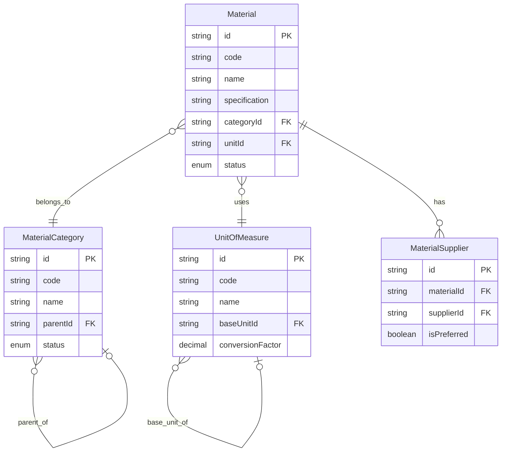
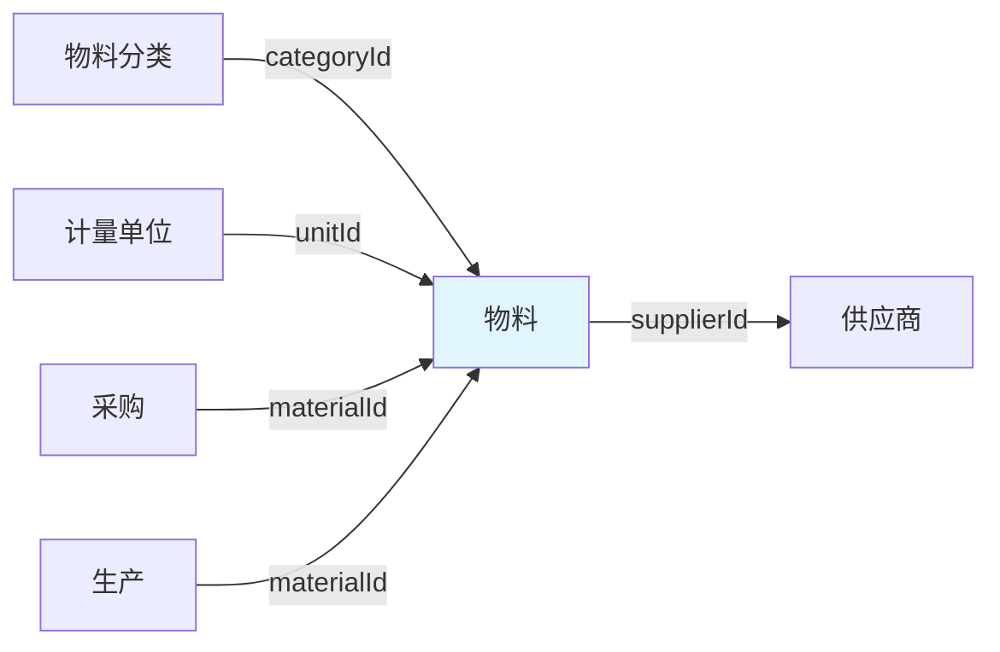
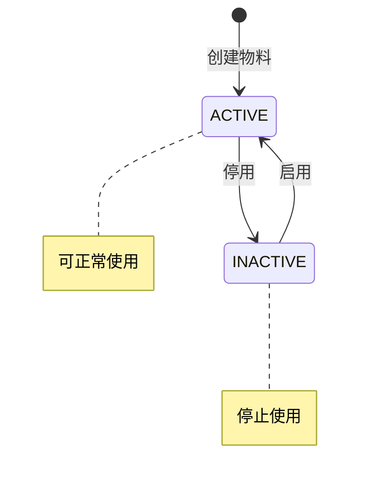

# 物料字典领域 - 物料模型

> 最后更新：2025-04-21

---

## 1 术语表

> 仅在用户澄清概念时记录

| 术语 | 定义 | 澄清来源 |
|------|------|----------|
| {概念} | {定义} | {用户原话} |

---

## 2 实体定义

### 实体关系图

### 物料（聚合根）

| 属性 | 类型 | 必填 | 说明 |
|------|------|------|------|
| id | string | ✓ | 唯一标识 |
| code | string | ✓ | 物料编码（系统自动生成） |
| name | string | ✓ | 物料名称 |
| specification | string | | 规格型号 |
| categoryId | string | ✓ | 物料分类ID |
| unitId | string | ✓ | 计量单位ID |
| status | enum | ✓ | 物料状态（ACTIVE/INACTIVE） |
| remark | string | | 备注 |
| createdAt | datetime | ✓ | 创建时间 |
| updatedAt | datetime | | 更新时间 |

### 物料分类（聚合根）

| 属性 | 类型 | 必填 | 说明 |
|------|------|------|------|
| id | string | ✓ | 唯一标识 |
| code | string | ✓ | 分类编码 |
| name | string | ✓ | 分类名称（面料、辅料、包装材料等） |
| parentId | string | | 父分类ID（支持层级） |
| status | enum | ✓ | 分类状态（ACTIVE/INACTIVE） |

### 计量单位（聚合根）

| 属性 | 类型 | 必填 | 说明 |
|------|------|------|------|
| id | string | ✓ | 唯一标识 |
| code | string | ✓ | 单位编码（M、KG、PCS） |
| name | string | ✓ | 单位名称（米、公斤、件） |
| baseUnitId | string | | 基准单位ID（换算基准） |
| conversionFactor | decimal | | 换算系数 |

### 物料供应商关联（内部实体）

| 属性 | 类型 | 必填 | 说明 |
|------|------|------|------|
| id | string | ✓ | 唯一标识 |
| materialId | string | ✓ | 物料ID（聚合内引用） |
| supplierId | string | ✓ | 供应商ID |
| isPreferred | boolean | | 是否首选供应商 |

---

## 3 聚合边界

**聚合：物料聚合**

- 聚合根：物料
- 内部实体：物料供应商关联（可多个）

**聚合：物料分类聚合**

- 聚合根：物料分类

**聚合：计量单位聚合**

- 聚合根：计量单位

---

## 4 上下游关系图

**关系说明：**

- **上游：**物料分类 → 物料（物料关联分类）
- **上游：**计量单位 → 物料（物料关联计量单位）
- **下游：**物料 → 供应商（物料关联供应商）
- **下游：**采购 → 物料（采购引用物料）
- **下游：**生产 → 物料（生产引用物料）

---

## 5 状态图

---

## 6 业务规则

| 规则ID | 规则描述 | 适用场景 |
|--------|----------|----------|
| R01 | 物料编码系统自动生成 | 创建物料 |
| R02 | 物料必须关联物料分类 | 创建物料 |
| R03 | 物料必须关联计量单位 | 创建物料 |
| R04 | 物料停用前需检查是否在采购/生产订单中使用 | 停用物料 |

---

## 7 补充流程图

> 仅在复杂领域设计

（暂无）

---

## 8 用例

| 用例 | 角色 | 操作 | 目标 |
|------|------|------|------|
| 创建物料 | 生产跟单员 | 创建新物料信息 | 为生产准备物料基础数据 |
| 修改物料 | 生产跟单员 | 更新物料规格、名称等信息 | 维护物料信息准确性 |
| 停用物料 | 业务经理 | 停用不再使用的物料 | 停止物料在业务中的使用 |
| 查询物料 | 生产跟单员 | 查询物料信息 | 获取物料详细信息用于生产计划 |