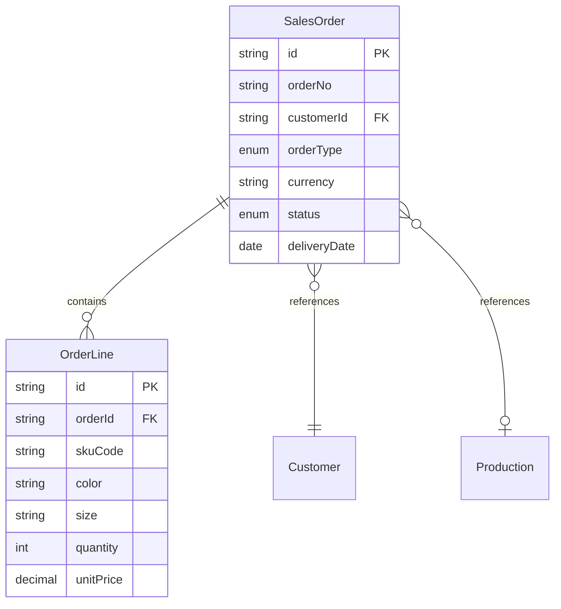
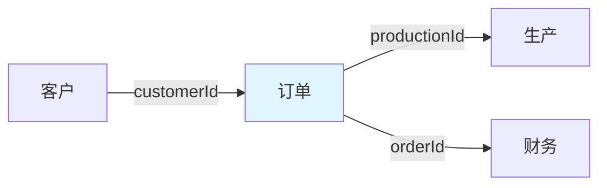

# 订单领域 - 销售订单模型

> 最后更新：2025-04-21

---

## 1 术语表

> 仅在用户澄清概念时记录

| 术语 | 定义 | 澄清来源 |
|------|------|----------|
| {概念} | {定义} | {用户原话} |

---

## 2 实体定义

### 实体关系图

### 销售订单（聚合根）

| 属性 | 类型 | 必填 | 说明 |
|------|------|------|------|
| id | string | ✓ | 唯一标识 |
| orderNo | string | ✓ | 订单编号（系统自动生成） |
| customerId | string | ✓ | 客户ID |
| orderType | enum | ✓ | 订单类型（大货订单） |
| productCategory | string | ✓ | 产品类别（成衣类型） |
| totalQuantity | int | ✓ | 总数量 |
| totalAmount | decimal | ✓ | 订单总金额（明细累加） |
| currency | string | ✓ | 订单币种 |
| deliveryDate | date | ✓ | 交货日期 |
| inspectionRequirement | object | | 验货要求（结构化属性：requirementType、description） |
| factoryAuditRequirement | object | | 验厂要求（结构化属性：auditType、description） |
| paymentStatus | enum | | 付款状态 |
| remark | string | | 备注 |
| attachments | string[] | | 附件列表（PO文档等） |
| productionId | string | | 生产单ID |
| status | enum | ✓ | 订单状态（待用户确认） |
| createdBy | string | ✓ | 创建人（业务员） |
| createdAt | datetime | ✓ | 创建时间 |
| updatedAt | datetime | | 更新时间 |

### 订单明细（内部实体）

| 属性 | 类型 | 必填 | 说明 |
|------|------|------|------|
| id | string | ✓ | 唯一标识 |
| orderId | string | ✓ | 订单ID（聚合内引用） |
| skuCode | string | ✓ | SKU编码 |
| color | string | ✓ | 颜色 |
| size | string | ✓ | 尺码 |
| quantity | int | ✓ | 数量 |
| unitPrice | decimal | ✓ | 单价 |
| totalPrice | decimal | ✓ | 小计金额（数量×单价） |

---

## 3 聚合边界

**聚合：订单聚合**

- 聚合根：销售订单
- 内部实体：订单明细（可多个）

---

## 4 上下游关系图

**关系说明：**

- **上游：**客户 → 订单（订单关联客户）
- **下游：**订单 → 生产（订单关联生产单）
- **下游：**订单 → 财务（订单付款关联）

---

## 5 状态图

> 待用户研究确认订单状态流转（待定项#1）

（状态机待确认）

---

## 6 业务规则

| 规则ID | 规则描述 | 适用场景 |
|--------|----------|----------|
| R01 | 订单金额 = SUM(明细数量 × 单价) | 创建/修改订单 |
| R02 | 订单创建需校验客户信用额度 | 创建订单 |
| R03 | 订单编号系统自动生成 | 创建订单 |
| R04 | 客户状态为停用时不能下新订单 | 创建订单 |
| R05 | 验货验厂要求默认继承客户设置 | 创建订单 |
| R06 | 订单明细数量和单价修改需同步更新总金额 | 修改订单 |

---

## 7 补充流程图

> 仅在复杂领域设计

（暂无）

---

## 8 用例

| 用例 | 角色 | 操作 | 目标 |
|------|------|------|------|
| 创建订单 | 业务经理 | 创建新订单信息 | 为生产准备订单数据 |
| 修改订单 | 业务经理 | 更新订单数量、交期等信息 | 维护订单信息准确性 |
| 确认订单 | 业务经理 | 确认订单信息无误 | 使订单进入正式状态 |
| 查询订单 | 业务经理 | 查询订单信息 | 获取订单详细信息用于业务决策 |