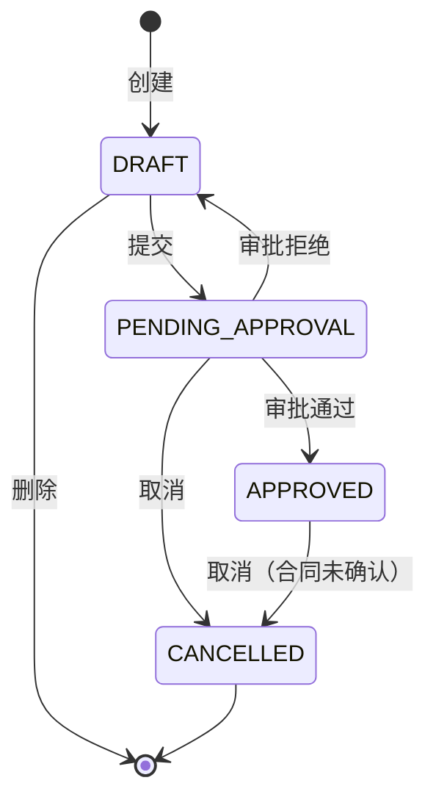
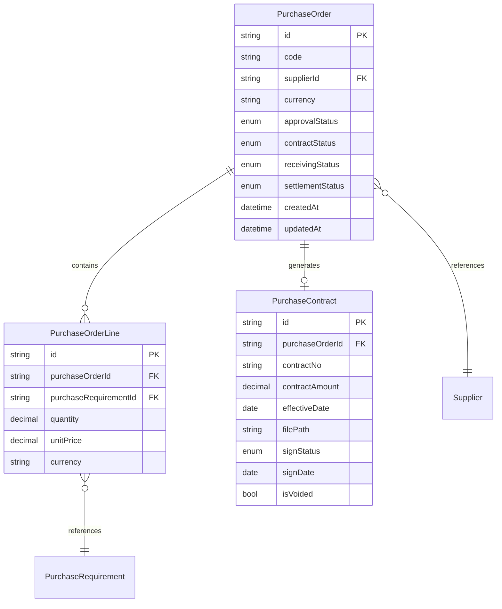
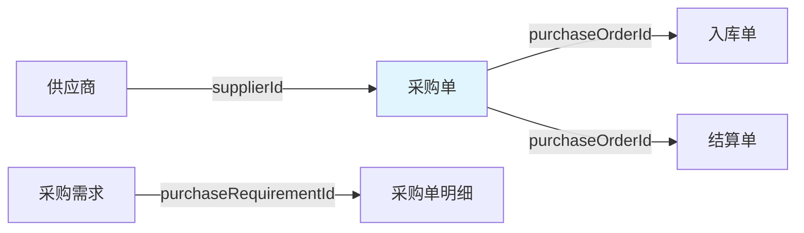
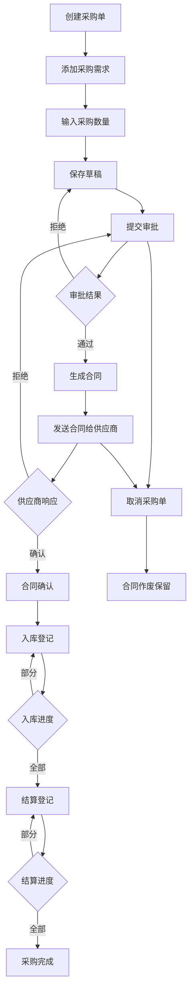

# 采购单领域模型

> 限界上下文：procurement
> 子域类型：核心域
> 聚合根：PurchaseOrder
> 最后更新：2026-04-22

---

## 1 领域词典

| 概念 | 是 | 不是 |
|------|------|------|
| 采购单 | 向供应商采购物料的需求单据 | 订单、采购申请 |
| 采购单明细 | 采购单中具体的物料采购条目 | 物料需求、订单明细 |
| 采购合同 | 采购单审批通过后生成的正式采购文件 | 订单合同、框架协议 |
| 供应商 | 提供货物的合作方 | 客户、工厂 |
| 审批状态 | 采购单是否通过审批的状态维度 | 合同状态、入库状态 |
| 合同状态 | 合同签署进度维度 | 审批状态 |
| 入库进度 | 货物入库进度维度 | 结算进度 |
| 结算进度 | 财务结算进度维度 | 入库进度 |

---

## 2 状态流转

### 正交状态设计（四个维度）

| 维度 | 字段名 | 状态值 | 控制事项 |
|------|--------|--------|----------|
| **审批状态** | `approvalStatus` | DRAFT / PENDING_APPROVAL / APPROVED / CANCELLED | 采购单是否通过审批 |
| **合同状态** | `contractStatus` | NONE / PENDING / CONFIRMED / REJECTED | 合同签署进度 |
| **入库进度** | `receivingStatus` | NONE / PARTIAL / FULL | 货物入库进度 |
| **结算进度** | `settlementStatus` | NONE / PARTIAL / FULL | 财务结算进度 |

### 状态矩阵（合法区域）

| approvalStatus | contractStatus | receivingStatus | settlementStatus | 允许操作 | 说明 |
|----------------|----------------|-----------------|------------------|----------|------|
| DRAFT | NONE | NONE | NONE | 编辑、删除、提交 | 草稿 |
| PENDING_APPROVAL | NONE | NONE | NONE | 取消、（等待审批） | 待审批 |
| APPROVED | PENDING | NONE | NONE | 取消、（等待供应商） | 合同待确认 |
| APPROVED | REJECTED | NONE | NONE | 无 | 合同拒绝，触发回到 PENDING_APPROVAL |
| APPROVED | CONFIRMED | NONE | NONE | 入库登记 | 执行中（未入库） |
| APPROVED | CONFIRMED | PARTIAL | NONE | 入库登记 | 部分入库 |
| APPROVED | CONFIRMED | FULL | NONE | 结算登记 | 全部入库 |
| APPROVED | CONFIRMED | FULL | PARTIAL | 结算登记 | 部分结算 |
| APPROVED | CONFIRMED | FULL | FULL | 无（终态） | 全部结算完成 |
| CANCELLED | * | * | * | 无（终态） | 已取消（合同保留作废） |

### 跨维度不变式

| 不变式ID | 约束 | 防止场景 |
|----------|------|----------|
| I01 | `approvalStatus ≠ APPROVED` → `contractStatus = NONE` | 未审批通过不能有合同 |
| I02 | `contractStatus ≠ CONFIRMED` → `receivingStatus = NONE` | 合同未确认不能入库 |
| I03 | `receivingStatus ≠ FULL` → `settlementStatus = NONE` | 未全部入库不能结算 |
| I04 | `approvalStatus = CANCELLED` → 所有操作禁止 | 取消后不可操作 |

### 状态图

---

## 3 实体定义

### 实体关系图

### 采购单（聚合根）

| 属性 | 类型 | 必填 | 说明 |
|------|------|------|------|
| id | string | ✓ | 唯一标识 |
| code | string | ✓ | 采购单编号 |
| supplierId | string | ✓ | 供应商ID |
| currency | string | ✓ | 交易币种 |
| approvalStatus | enum | ✓ | 审批状态（DRAFT/PENDING_APPROVAL/APPROVED/CANCELLED） |
| contractStatus | enum | ✓ | 合同状态（NONE/PENDING/CONFIRMED/REJECTED） |
| receivingStatus | enum | ✓ | 入库进度（NONE/PARTIAL/FULL） |
| settlementStatus | enum | ✓ | 结算进度（NONE/PARTIAL/FULL） |
| createdAt | datetime | ✓ | 创建时间 |
| updatedAt | datetime | | 更新时间 |

### 采购单明细（内部实体）

| 属性 | 类型 | 必填 | 说明 |
|------|------|------|------|
| id | string | ✓ | 唯一标识 |
| purchaseOrderId | string | ✓ | 采购单ID |
| purchaseRequirementId | string | ✓ | 采购需求ID |
| quantity | decimal | ✓ | 采购数量 |
| unitPrice | decimal | ✓ | 单价 |
| currency | string | ✓ | 币种 |

### 采购合同（内部实体）

| 属性 | 类型 | 必填 | 说明 |
|------|------|------|------|
| id | string | ✓ | 唯一标识 |
| purchaseOrderId | string | ✓ | 采购单ID |
| contractNo | string | ✓ | 合同编号 |
| contractAmount | decimal | ✓ | 合同金额 |
| effectiveDate | date | ✓ | 生效日期 |
| filePath | string | ✓ | 文件路径 |
| signStatus | enum | ✓ | 签署状态（PENDING/CONFIRMED/REJECTED） |
| signDate | date | | 签署日期 |
| isVoided | bool | ✓ | 是否作废（取消后保留作废） |

---

## 4 业务规则

| 规则ID | 规则名 | WHEN | THEN | 约束 |
|--------|--------|------|------|------|
| R001 | 单供应商约束 | 创建采购单 | 校验 supplierId 必选 | 一个采购单只能有一个供应商 |
| R002 | 有效采购需求 | 添加采购明细 | 校验 purchaseRequirementId.effectiveStatus = ACTIVE | 无效采购需求不可采购 |
| R003 | 采购数量上限 | 设置采购数量 | 校验 quantity <= purchaseRequirement.requiredQuantity - purchaseRequirement.purchasedQuantity | 不能超额采购 |
| R004 | 合同确认前取消 | 取消采购单 | 校验 contractStatus ≠ CONFIRMED | 合同确认后不可取消 |
| R005 | 合同金额计算 | 生成合同 | contractAmount = SUM(line.quantity × line.unitPrice) | 金额来源于明细汇总 |
| R006 | 供应商拒绝处理 | 供应商拒绝合同 | 设置 approvalStatus = PENDING_APPROVAL，contractStatus = NONE | 回到待审批重新修改 |
| R007 | 取消合同作废 | 取消采购单 | 设置 contract.isVoided = true | 合同文件保留作废 |
| R008 | 入库进度判断 | 入库登记 | IF receivedQuantity >= totalQuantity THEN receivingStatus = FULL ELSE receivingStatus = PARTIAL | 允许多次累加 |
| R009 | 结算进度判断 | 结算登记 | IF settledAmount >= contractAmount THEN settlementStatus = FULL ELSE settlementStatus = PARTIAL | 允许多次累加 |

### 不变式

| 不变式ID | 不变式名 | 约束条件 | 防止场景 |
|----------|----------|----------|----------|
| I001 | 单供应商 | COUNT(DISTINCT supplierId) = 1 | 防止多供应商采购 |
| I002 | 有效采购需求引用 | 所有 purchaseRequirementId.effectiveStatus = ACTIVE | 防止无效需求被采购 |
| I003 | 合同唯一 | COUNT(contract) <= 1 | 防止重复生成合同 |
| I004 | 审批与合同关联 | `approvalStatus ≠ APPROVED` → `contractStatus = NONE` | 未审批通过不能有合同 |
| I005 | 合同与入库关联 | `contractStatus ≠ CONFIRMED` → `receivingStatus = NONE` | 合同未确认不能入库 |
| I006 | 入库与结算关联 | `receivingStatus ≠ FULL` → `settlementStatus = NONE` | 未全部入库不能结算 |
| I007 | 取消禁止操作 | `approvalStatus = CANCELLED` → 所有操作禁止 | 取消后不可操作 |

---

## 5 领域事件

| 事件名 | 携带数据 | 预期消费者 | 执行动作 |
|--------|----------|----------|----------|
| PurchaseOrderSubmitted | `purchaseOrderId, supplierId` | 审批模块 | 发起审批流程 |
| PurchaseOrderApproved | `purchaseOrderId, contractId` | 合同生成服务 | 生成采购合同文件 |
| PurchaseContractSent | `contractId, supplierId` | 供应商系统 | 发送合同给供应商 |
| PurchaseContractConfirmed | `contractId, purchaseOrderId` | 采购模块 | contractStatus = CONFIRMED |
| PurchaseContractRejected | `contractId, purchaseOrderId, reason` | 采购模块 | approvalStatus = PENDING_APPROVAL, contractStatus = NONE |
| PurchaseOrderCancelled | `purchaseOrderId, reason` | 采购需求模块 | 更新采购需求采购数量，合同作废 |
| GoodsReceived | `purchaseOrderId, lineId, quantity` | 采购需求模块、库存模块 | 更新入库数量、库存增加、判断 receivingStatus |
| PurchaseSettled | `purchaseOrderId, amount` | 财务模块 | 创建付款记录、判断 settlementStatus |

---

## 6 聚合边界

| 聚合名 | 聚合根 | 内部实体 |
|--------|--------|----------|
| 采购单聚合 | 采购单 | 采购单明细、采购合同 |

---

## 7 上下游关系图

---

## 8 用例

| 用例 | 角色 | 操作 | 目标 |
|------|------|------|------|
| 创建采购单 | 采购员 | 选择供应商、添加采购需求、输入数量 | 创建草稿采购单 |
| 编辑采购单 | 采购员 | 修改明细数量、删除明细 | 更新草稿采购单 |
| 提交采购单 | 采购员 | 提交采购单审批 | 发起审批流程 |
| 审批采购单 | 业务经理 | 审批通过/拒绝 | 控制采购单流转 |
| 取消采购单 | 采购员 | 取消采购单 | 终止采购流程（合同作废） |
| 碃认合同 | 供应商 | 碃认/拒绝合同 | 进入执行或回到审批 |
| 入库登记 | 仓库员 | 登记入库数量 | 更新入库进度（允许多次累加） |
| 结算付款 | 财务主管 | 创建付款记录 | 更新结算进度（允许多次累加） |

---

## 9 补充流程图

### 采购流程全景

---

## 10 待定任务

| # | 待定内容 | 来源 | 状态 |
|---|----------|------|------|
| 1 | 审批拒绝后是否需要通知采购员 | 业务经理评审 | 待确认 |
| 2 | 汇率核算时机（交易币种与结算币种转换） | 财务主管评审 | 待确认 |
| 3 | 采购单编号生成规则 | 系统架构师评审 | 待确认 |
| 4 | 合同编号生成规则 | 系统架构师评审 | 待确认 |
| 5 | 合同文件生成时机（审批通过时？审批通过后异步？） | 系统架构师评审 | 待确认 |
| 6 | 入库数量阈值判断（什么条件下判定 FULL） | 系统架构师评审 | 待确认 |
| 7 | 结算金额阈值判断（什么条件下判定 FULL） | 系统架构师评审 | 待确认 |

---

## 11 附录：用户自定义内容

> 来源：draft/purchase-contract.md

### 用户原话

> "用户可以创建采购单，采购可以添加采购的物料需求，然后输入要采购的数量，提交采购单，后台生成采购合同文件，一个采购单只能跟一个供应商采购。"

### 澄清记录

| 问题 | 答案 |
|------|------|
| 供应商选择时机 | 创建时必选 |
| 草稿状态 | 需要 |
| 审批流程 | 需要 |
| 合同用途 | 需供应商确认 |
| 取消时机 | 合同确认前可取消 |
| 合同拒绝处理 | 回到待审批 |
| 合同确认后 | 进入执行状态 |
| 执行后续状态 | 已入库、已结算 |
| 多币种 | 支持 |
| 合同文件属性 | 包含合同详情 |
| PARTIAL 状态 | 仅标记（不记录数量） |
| 取消后合同处理 | 保留作废 |
| 入库/结算累加 | 允许多次累加 |

### 角色评审汇总

| 角色 | 核心建议 | 待定项 |
|------|----------|--------|
| 业务经理 | 流程完整性、取消时机合理 | 审批拒绝后是否需要通知采购员 |
| 财务主管 | 多币种支持、结算进度独立维度 | 汇率核算时机 |
| 系统架构师 | 聚合边界合理、正交状态设计 | 编号生成规则 |

### 自检清单执行

| 序号 | 检查项 | 结果 |
|------|--------|------|
| 1 | `[状态正交]` | ✓ 四维度正交状态，跨维度不变式已补充 |
| 2 | `[属性除冗]` | ✓ PARTIAL 仅标记，不存储数量；contractAmount 存储为历史记录 |
| 3 | `[规则纯度]` | ✓ 规则只返回布尔判断或计算值，动作在事件中 |
| 4 | `[事件过去时]` | ✓ 事件命名均为过去时格式 |
| 5 | `[边界隔离]` | ✓ 跨界协同以事件形式存在 |