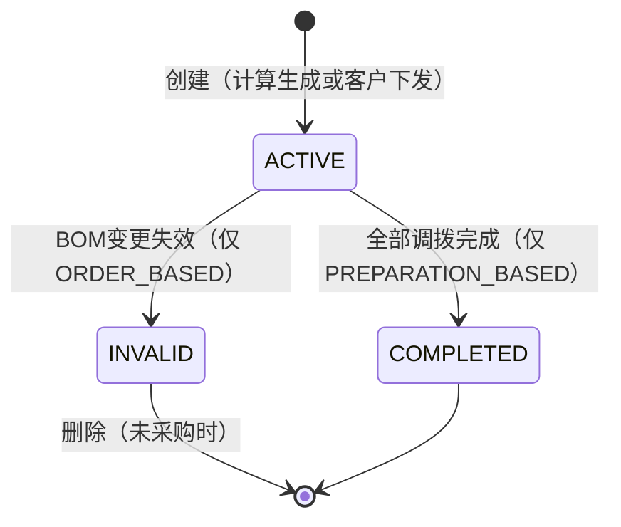
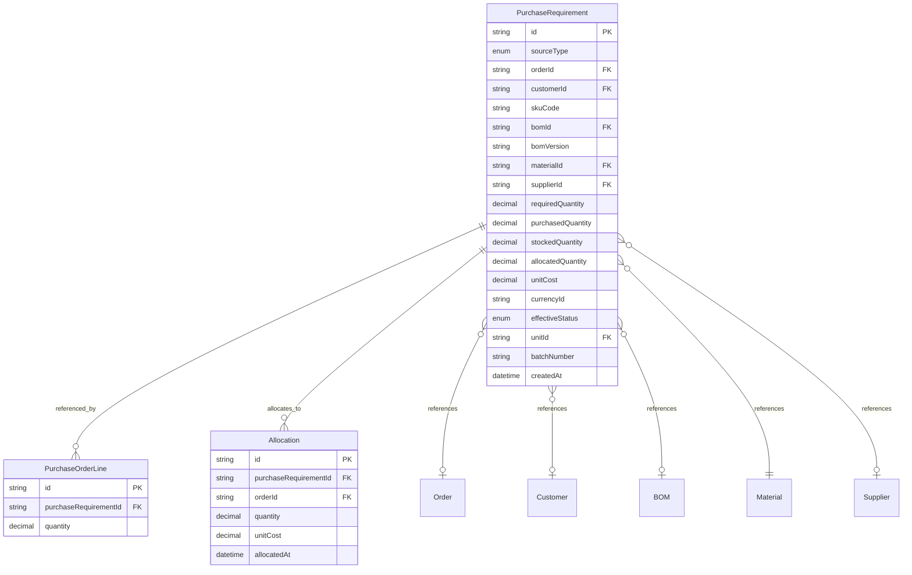
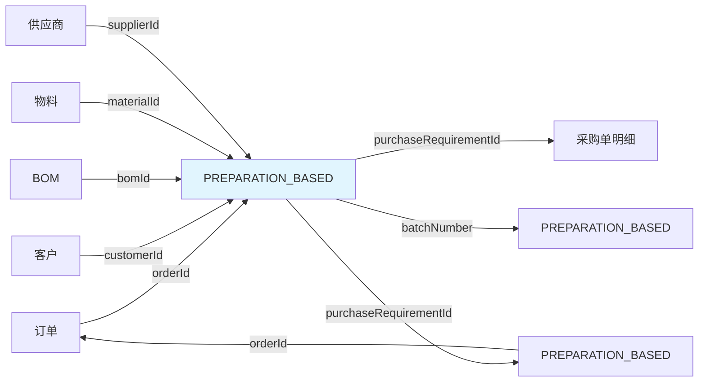

# 采购需求领域模型

> 限界上下文：procurement
> 子域类型：核心域
> 聚合根：PurchaseRequirement
> 最后更新：2026-04-22
> **重要变更**：原"物料需求"与"备料指令"统一为"采购需求"模型

---

## 1 领域词典

| 概念 | 是 | 不是 |
|------|------|------|
| 采购需求 | 驱动采购的需求数据（来源：订单计算或备料指令） | 采购订单、库存需求 |
| 来源类型 | 采购需求的来源（ORDER_BASED / PREPARATION_BASED） | 状态 |
| 生效状态 | 采购需求的可用性状态（ACTIVE/INVALID） | 采购状态 |
| 备料指令 | 客户下发的采购指令，指定物料、数量、供应商（PREPARATION_BASED 类型） | 采购订单 |

---

## 2 状态流转

### 生效状态

| 当前状态 | 触发条件 | 目标状态 | 副作用 | 禁止动作 | 禁止原因 |
|----------|----------|----------|----------|----------|----------|
| `ACTIVE` | BOM变更导致采购需求失效（仅 ORDER_BASED） | `INVALID` | 如果已采购，保留记录；如果未采购，可删除 | 采购 | 采购需求无效，不允许采购 |
| `INVALID`（终态） | - | - | - | 采购、修改 | 无效采购需求不可操作 |

### 采购状态（逻辑状态）

| 采购数量条件 | 采购状态 | 说明 |
|--------------|----------|------|
| purchasedQuantity = 0 | 未采购 | 未开始采购 |
| purchasedQuantity < requiredQuantity | 部分采购 | 部分采购完成 |
| purchasedQuantity >= requiredQuantity | 已采购 | 采购完成 |

### 入库状态（PREPARATION_BASED 特有）

| 入库数量条件 | 入库状态 | 说明 |
|--------------|----------|------|
| stockedQuantity = 0 | 未入库 | 未开始入库 |
| stockedQuantity < requiredQuantity | 部分入库 | 部分入库 |
| stockedQuantity >= requiredQuantity | 已入库 | 全部入库 |

### 调拨状态（PREPARATION_BASED 特有）

| 调拨数量条件 | 调拨状态 | 说明 |
|--------------|----------|------|
| allocatedQuantity = 0 | 未调拨 | 未开始调拨 |
| allocatedQuantity < stockedQuantity | 部分调拨 | 部分调拨到订单 |
| allocatedQuantity >= stockedQuantity | 已调拨 | 全部调拨完成 |

### 正交状态矩阵

| 生效状态 | 采购状态 | 允许操作 | 说明 |
|----------|----------|----------|------|
| ACTIVE | 未采购 | 创建采购单 | 正常状态，可采购 |
| ACTIVE | 部分采购 | 创建采购单 | 部分采购，继续采购 |
| ACTIVE | 已采购 | 无 | 采购完成 |
| INVALID | 未采购 | 删除 | BOM变更无效，未采购，可删除 |
| INVALID | 部分采购 | 标记无效 | BOM变更无效，部分采购，不能删除 |
| INVALID | 已采购 | 标记无效 | BOM变更无效，已采购，不能删除 |

### 状态图

---

## 3 实体定义

### 实体关系图

### 采购需求（聚合根）

| 属性 | 类型 | 必填 | 说明 |
|------|------|------|------|
| id | string | ✓ | 唯一标识 |
| sourceType | enum | ✓ | 来源类型（ORDER_BASED / PREPARATION_BASED） |
| orderId | string | | 订单ID（ORDER_BASED 必填） |
| customerId | string | | 客户ID（PREPARATION_BASED 必填） |
| skuCode | string | | SKU编码（ORDER_BASED 必填） |
| bomId | string | | BOM ID（ORDER_BASED 必填） |
| bomVersion | string | | BOM版本（ORDER_BASED 必填，用于跟踪BOM变更） |
| materialId | string | ✓ | 物料ID |
| supplierId | string | | 供应商ID（PREPARATION_BASED 必填，客户指定） |
| requiredQuantity | decimal | ✓ | 需求数量 |
| purchasedQuantity | decimal | ✓ | 采购数量（累计，默认0） |
| stockedQuantity | decimal | | 入库数量（PREPARATION_BASED 必填，默认0） |
| allocatedQuantity | decimal | | 调拨数量（PREPARATION_BASED 必填，默认0） |
| unitCost | decimal | | 采购单价（成本） |
| currencyId | string | | 采购币种 |
| effectiveStatus | enum | ✓ | 生效状态（ACTIVE/INVALID） |
| unitId | string | ✓ | 计量单位ID |
| batchNumber | string | | 入库批次号（PREPARATION_BASED，用于标记库存归属） |
| createdAt | datetime | ✓ | 创建时间 |
| updatedAt | datetime | | 更新时间 |

### 调拨记录（内部实体，PREPARATION_BASED 特有）

| 属性 | 类型 | 必填 | 说明 |
|------|------|------|------|
| id | string | ✓ | 唯一标识 |
| purchaseRequirementId | string | ✓ | 采购需求ID |
| orderId | string | ✓ | 订单ID |
| quantity | decimal | ✓ | 调拨数量 |
| unitCost | decimal | ✓ | 调拨单价（来源于采购需求成本） |
| allocatedAt | datetime | ✓ | 调拨时间 |

---

## 4 业务规则

| 规则ID | 规则名 | WHEN | THEN | 约束 |
|--------|--------|------|------|------|
| R001 | 无需求禁止采购 | 创建采购单明细 | 校验采购需求 effectiveStatus = ACTIVE | 采购需求必须生效 |
| R002 | 采购需求计算生效（ORDER_BASED） | 计算采购需求 | 设置 effectiveStatus = ACTIVE，sourceType = ORDER_BASED | 订单计算后生效 |
| R003 | BOM变更触发无效（ORDER_BASED） | BOM变更导致采购需求失效 | 设置 effectiveStatus = INVALID | 需校验采购状态 |
| R004 | 无效采购需求删除条件 | 删除采购需求 | 校验 effectiveStatus = INVALID && purchasedQuantity = 0 | 未采购且无效才能删除 |
| R005 | 采购数量累加 | 创建/修改采购单明细 | 更新 purchasedQuantity = SUM(采购单明细数量) | 需乐观锁控制并发 |
| R006 | 采购需求不可修改 | 修改采购需求 | 禁止修改（只能通过BOM变更或采购行为触发） | 保证一致性 |
| R007 | 客户指定供应商（PREPARATION_BASED） | 创建备料指令 | supplierId 必填 | 供应商由客户指定 |
| R008 | 入库数量累加（PREPARATION_BASED） | 物料入库 | 更新 stockedQuantity，生成 batchNumber | 入库时标记批次号 |
| R009 | 调拨数量累加（PREPARATION_BASED） | 调拨到订单 | 更新 allocatedQuantity | 需乐观锁控制并发 |
| R010 | 调拨成本带入（PREPARATION_BASED） | 调拨到订单 | Allocation.unitCost = PurchaseRequirement.unitCost | 成本追溯 |
| R011 | 取消时库存处理（PREPARATION_BASED） | 取消备料指令 | 已入库物料转为通用库存（清空 batchNumber） | 仅 DRAFT/PENDING 状态可取消 |
| R012 | 部分调拨允许（PREPARATION_BASED） | 调拨到订单 | allocatedQuantity < stockedQuantity | 可多次调拨 |

### 不变式

| 不变式ID | 不变式名 | 约束条件 | 防止场景 |
|----------|----------|----------|----------|
| I001 | 生效需求可采购 | effectiveStatus = ACTIVE → 允许采购操作 | 防止无效需求被采购 |
| I002 | 无效需求可删除 | effectiveStatus = INVALID && purchasedQuantity = 0 → 允许删除 | 防止已采购需求被删除 |
| I003 | 采购数量不超需求数量 | purchasedQuantity <= requiredQuantity | 防止超额采购 |
| I004 | 数量一致性（PREPARATION_BASED） | purchasedQuantity >= stockedQuantity >= allocatedQuantity | 防止数据不一致 |
| I005 | 调拨不超过入库（PREPARATION_BASED） | allocatedQuantity <= stockedQuantity | 防止超额调拨 |
| I006 | 取消状态限制（PREPARATION_BASED） | 取消仅允许未入库或部分入库状态 | 防止已调拨被取消 |

---

## 5 领域事件

| 事件名 | 携带数据 | 预期消费者 | 执行动作 |
|--------|----------|----------|----------|
| PurchaseRequirementCreated | `purchaseRequirementId, sourceType, materialId, requiredQuantity` | 采购模块 | 创建采购申请 |
| PurchaseRequirementInvalidated | `purchaseRequirementId, purchasedQuantity` | 采购模块、财务模块 | 停止采购、财务处理 |
| PurchaseQuantityUpdated | `purchaseRequirementId, purchasedQuantity` | 生产模块 | 更新采购进度 |
| StockPreparationCreated | `purchaseRequirementId, customerId, materialId, supplierId` | 采购模块 | 创建采购申请（PREPARATION_BASED） |
| StockPreparationCancelled | `purchaseRequirementId, stockedQuantity, batchNumber` | 库存模块 | 清空批次号，转为通用库存 |
| StockPreparationAllocated | `purchaseRequirementId, orderId, quantity, unitCost` | 订单模块 | 订单物料成本更新 |
| StockPreparationCompleted | `purchaseRequirementId` | 客户模块 | 通知客户备料完成 |

---

## 6 聚合边界

| 聚合名 | 聚合根 | 内部实体 |
|--------|--------|----------|
| 采购需求聚合 | 采购需求 | 调拨记录（Allocation，PREPARATION_BASED 特有） |

---

## 7 上下游关系图

---

## 8 用例

| 用例 | 角色 | 操作 | 目标 |
|------|------|------|------|
| 计算采购需求（ORDER_BASED） | 生产跟单员 | 根据订单SKU和BOM计算采购需求 | 生成采购需求清单 |
| 创建备料指令（PREPARATION_BASED） | 业务经理 | 接收客户备料指令，录入系统 | 生成采购需求 |
| 标记采购需求无效（ORDER_BASED） | 生产跟单员 | BOM变更后标记采购需求无效 | 停止采购 |
| 删除无效采购需求 | 生产跟单员 | 删除未采购的无效采购需求 | 清理无效数据 |
| 取消备料指令（PREPARATION_BASED） | 业务经理 | 客户取消备料指令 | 停止采购，库存转为通用 |
| 查询采购需求 | 业务经理 | 查询采购需求列表 | 了解采购进度 |
| 创建采购单 | 采购员 | 基于采购需求创建采购单 | 执行采购 |
| 调拨物料到订单（PREPARATION_BASED） | 业务经理 | 订单来时，从备料库存调拨 | 物料分配到订单 |
| 查询备料成本 | 财务主管 | 查询采购成本 | 成本核算 |

---

## 9 补充流程图

（暂无）

---

## 10 待定任务

| # | 待定内容 | 来源 | 状态 |
|---|----------|------|------|
| 1 | 采购需求拆分审批流程 | 业务经理评审 | 待确认 |
| 2 | 采购需求计算触发时机 | 生产跟单员评审 | 待确认 |
| 3 | 无效采购需求的财务处理 | 财务主管评审 | 待确认 |
| 4 | 采购需求成本字段设计 | 财务主管评审 | 待确认 |
| 5 | BOM变更触发采购需求无效的具体条件 | 生产跟单员评审 | 待确认 |
| 6 | 备料指令编号生成规则 | 系统架构师评审 | 待确认 |
| 7 | 多币种采购的汇率处理 | 财务主管评审 | 待确认 |

---

## 11 附录：用户自定义内容

> 来源：draft/material-requirement.md + draft/stock-preparation.md

### 用户原话（ORDER_BASED）

> "订单的sku x bom =物料需求，物料需求用来驱动采购，没有需求不允许采购
> 物料需求是通过bom的物料计算功能算出来的，计算之后则生效，但是bom可能变更，变更之后可能导致之前算出来的物料需求无效，但是如果已经采购了，则物料标记无效，不能删除，如果没采购直接就不需要了，可以删除"

### 用户原话（PREPARATION_BASED）

> "国外客户给我们下备料指令了"
> "没有他们就直接告诉我们什么东西去哪买多少就"
> "未来会下订单，下来订单之后我们再调拨这些物料到订单上"
> "需要纳入系统，因为要采购"

### 重要决策：统一采购需求模型

> 用户决策：备料指令与物料需求统一为"采购需求"模型

采购需求（PurchaseRequirement）有两种来源类型：
- `ORDER_BASED`：订单SKU × BOM 计算（原物料需求）
- `PREPARATION_BASED`：备料指令（客户手动指定）

### 角色评审汇总

| 角色 | 核心建议 | 待定项 |
|------|----------|--------|
| 业务经理 | 物料需求拆分需审批、取消时库存处理需明确 | 物料需求拆分审批流程 |
| 生产跟单员 | BOM变更触发条件说明 | 物料需求计算触发时机 |
| 系统架构师 | 采购数量更新需乐观锁、删除前置校验、统一采购需求模型 | 编号生成规则 |
| 财务主管 | 无效采购需求的财务处理、成本记录需明确 | 多币种采购的汇率处理 |