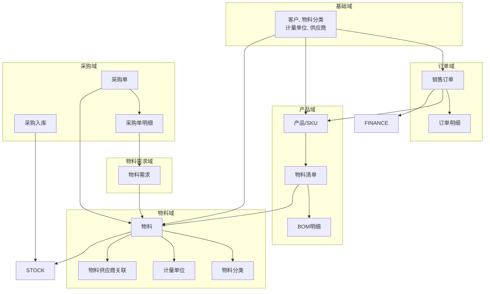

# 领域模型汇总

> 最后更新：2025-04-21
> 模板：`.agents/skills/mdd-apply/references/model-summary-template.md`

---

## 一、领域全景图

---

## 二、聚合根索引

| 聚合根 | 所属域 | 核心职责 | 关键状态 |
|--------|--------|----------|----------|
| **Customer** | 基础域 | 管理客户信息、联系人、银行账户 | ACTIVE → INACTIVE |
| **MaterialCategory** | 基础域 | 管理物料分类层级 | ACTIVE → INACTIVE |
| **UnitOfMeasure** | 基础域 | 管理计量单位及换算关系 | ACTIVE → INACTIVE |
| **SalesOrder** | 订单域 | 管理订单从创建到交付的全生命周期 | DRAFT → CONFIRMED → DELIVERED（待确认） |
| **OrderLine** | 订单域 | 订单中的具体SKU条目 | - |
| **Product** | 产品域 | 管理产品SKU信息 | ACTIVE → INACTIVE |
| **BOM** | 产品域 | 维护产品对应的物料配置和单耗 | DRAFT → PUBLISHED → INACTIVE |
| **BOMLine** | 产品域 | BOM中的具体物料条目 | - |
| **Material** | 物料域 | 管理物料基本信息、分类、单位 | ACTIVE → INACTIVE |
| **MaterialSupplier** | 物料域 | 物料与供应商的关联关系 | - |
| **MaterialRequirement** | 物料需求域 | 订单SKU与BOM计算得出的采购驱动数据 | ACTIVE → INVALID |

---

## 六、演进记录

| 日期 | 变更内容 | 涉及领域 |
|------|----------|----------|
| 2025-04-21 | 初始化领域模型结构 | customer, order, material, bom, inventory, production, finance, purchasing, base |
| 2025-04-21 | 完成客户管理领域设计 | customer |
| 2025-04-21 | 完成订单管理领域设计 | order |
| 2025-04-21 | 完成物料字典领域设计 | material |
| 2025-04-21 | 完成物料清单领域设计 | bom |
| 2025-04-21 | customer 状态简化：删除 state.md，合并到主文件 | customer |
| 2025-04-21 | 反思改进：删除过度DDD抽象，改为用户价值导向 | 全局 |
| 2025-04-21 | material、customer、order 按新规范优化 | material, customer, order |
| 2025-04-21 | 精简 design/model.md，删除多余章节 | 全局 |
| 2026-04-21 | 完成物料需求领域设计 | material-requirement |