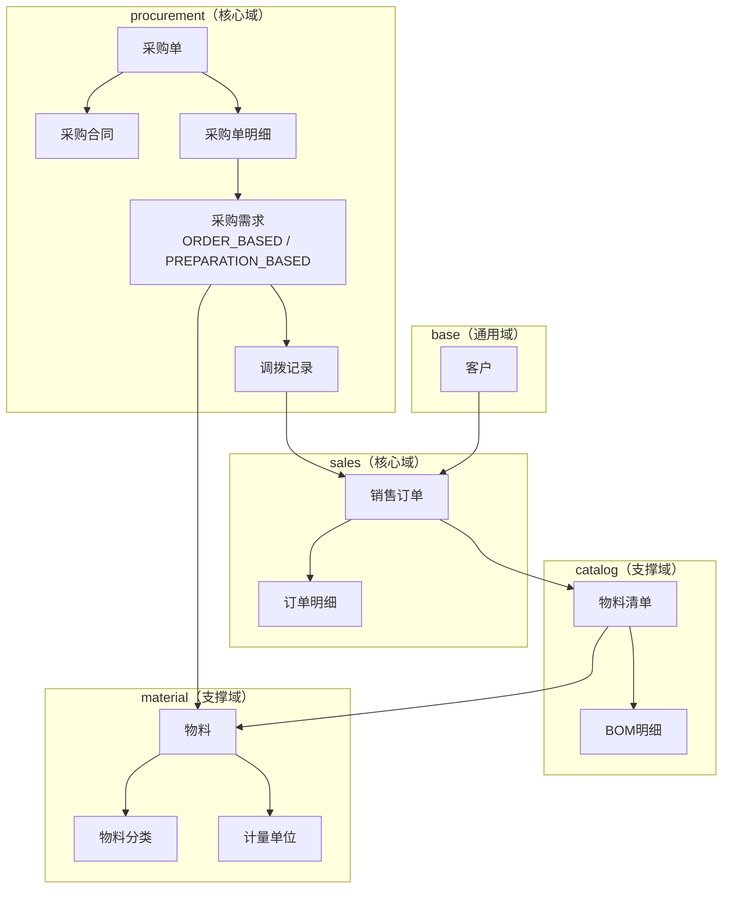

# 领域模型汇总

> 最后更新：2026-04-22
> 模板：`.agents/skills/mdd-apply/references/model-summary-template.md`

---

## 一、目录结构

```
design/domain/
  sales/              # 销售限界上下文（核心域）
    order.md          # SalesOrder 聚合
    
  procurement/        # 采购限界上下文（核心域）
    purchase-requirement.md  # PurchaseRequirement 聚合
    purchase-order.md        # PurchaseOrder 聚合
    
  catalog/            # 产品目录限界上下文（支撑域）
    bom.md            # BOM 聚合
    
  material/           # 物料管理限界上下文（支撑域）
    material.md       # Material 聚合
    
  base/               # 基础数据限界上下文（通用域）
    customer.md       # Customer 聚合
    
  inventory/          # 库存限界上下文（支撑域）- 待设计
  production/         # 生产限界上下文（支撑域）- 待设计
  finance/            # 财务限界上下文（支撑域）- 待设计
```

---

## 二、限界上下文索引

| 限界上下文 | 子域类型 | 核心职责 | 当前聚合 |
|------------|----------|----------|----------|
| **sales** | 核心域 | 客户接单到交付全流程 | SalesOrder |
| **procurement** | 核心域 | 供应商采购全流程 | PurchaseRequirement, PurchaseOrder |
| **catalog** | 支撑域 | 产品SKU与BOM管理 | BOM |
| **material** | 支撑域 | 物料字典管理 | Material |
| **base** | 通用域 | 基础数据管理 | Customer |
| **inventory** | 支撑域 | 库存管理 | 待设计 |
| **production** | 支撑域 | 生产管理 | 待设计 |
| **finance** | 支撑域 | 财务结算 | 待设计 |

---

## 三、聚合根索引

| 聚合根 | 所属限界上下文 | 子域类型 | 核心职责 | 关键状态 |
|--------|----------------|----------|----------|----------|
| **SalesOrder** | sales | 核心域 | 管理订单从创建到交付的全生命周期 | 待确认 |
| **PurchaseRequirement** | procurement | 核心域 | 统一的采购需求（订单计算或备料指令） | ACTIVE → INVALID |
| **PurchaseOrder** | procurement | 核心域 | 向供应商采购物料的单据，含合同签署流程 | 四维度正交状态 |
| **BOM** | catalog | 支撑域 | 维护产品对应的物料配置和单耗 | DRAFT → PUBLISHED → INACTIVE |
| **Material** | material | 支撑域 | 管理物料基本信息、分类、单位 | ACTIVE → INACTIVE |
| **Customer** | base | 通用域 | 管理客户信息、联系人、银行账户 | ACTIVE → INACTIVE |

---

## 四、领域全景图



---

## 五、演进记录

| 日期 | 变更内容 | 涉及领域 |
|------|----------|----------|
| 2025-04-21 | 初始化领域模型结构 | 全局 |
| 2025-04-21 | 完成客户管理领域设计 | base/customer |
| 2025-04-21 | 完成订单管理领域设计 | sales/order |
| 2025-04-21 | 完成物料字典领域设计 | material/material |
| 2025-04-21 | 完成物料清单领域设计 | catalog/bom |
| 2025-04-21 | customer 状态简化：删除 state.md，合并到主文件 | base/customer |
| 2025-04-21 | 反思改进：删除过度DDD抽象，改为用户价值导向 | 全局 |
| 2025-04-21 | 精简 design/model.md，删除多余章节 | 全局 |
| 2026-04-21 | 完成物料需求领域设计 | procurement/purchase-requirement |
| 2026-04-22 | 完成采购领域设计（采购单、采购合同、正交状态） | procurement/purchase-order |
| 2026-04-22 | 统一采购需求模型：物料需求 + 备料指令 → 采购需求 | procurement/purchase-requirement |
| 2026-04-22 | 目录结构重构：按限界上下文组织 | 全局 |