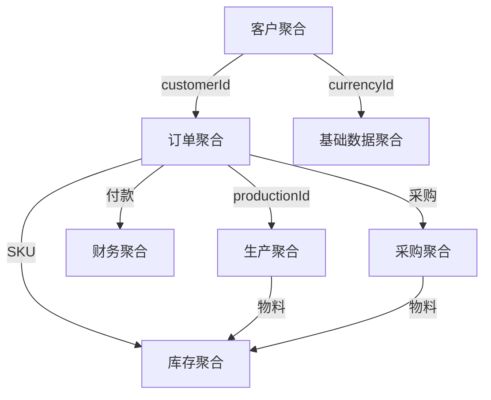

# 领域模型汇总

> 最后更新：2026-04-21

---

## 一、领域模型图

---

## 二、领域概览

| 领域 | 状态 | 文件 | 说明 |
|------|------|------|------|
| customer | ✓ 已设计 | customer.md + customer-state.md | 客户领域 - 客户模型 |
| order | ✓ 已设计 | order.md | 订单领域 - 销售订单模型 |
| inventory | ○ 待设计 | inventory.md | 库存领域 - 库存模型 |
| production | ○ 待设计 | production.md | 生产领域 - 生产模型 |
| finance | ○ 待设计 | finance.md | 财务领域 - 财务模型 |
| purchasing | ○ 待设计 | purchasing.md | 采购领域 - 采购模型 |
| base | ○ 待设计 | base.md | 基础数据领域 - 基础数据模型 |

---

## 三、统一术语表

| 术语 | 英文名 | 定义 | 所属领域 | 关联术语 |
|------|--------|------|----------|----------|
| 客户 | Customer | 国外客户，购买服装大货订单的贸易对象 | customer | 订单、联系人、银行账户 |
| 联系人 | Contact | 客户公司的业务对接人 | customer | 客户 |
| 银行账户 | BankAccount | 客户收款银行账户信息 | customer | 客户、币种 |
| 验货要求 | InspectionRequirement | 客户对产品质量的检验要求 | customer | 客户、订单 |
| 验厂要求 | FactoryAuditRequirement | 客户对工厂的社会责任审核要求 | customer | 客户 |
| 信用额度 | CreditLimit | 客户可用的信用额度上限 | customer | 客户、订单 |
| 销售订单 | SalesOrder | 客户下达的成衣大货订单 | order | 客户、订单明细、SKU |
| 订单明细 | OrderLine | 订单中的具体SKU条目，包含颜色尺码 | order | 订单、SKU |
| SKU | SKU | 具体的颜色尺码组合 | order | 订单明细、产品 |
| 成衣 | Garment | 服装产品的统称 | order | SKU、订单 |
| 大货订单 | BulkOrder | 大批量生产的正式订单 | order | 订单 |

---

## 四、聚合间引用

| 聚合A | 聚合B | 引用方式 | 说明 |
|-------|-------|----------|------|
| 订单聚合 | 客户聚合 | customerId | 订单关联客户 |
| 订单聚合 | 生产聚合 | productionId | 订单关联生产单 |
| 订单聚合 | 财务聚合 | orderId | 订单付款关联 |
| 客户聚合 | 基础数据聚合 | currencyId, countryId | 客户币种、国家 |

---

## 五、演进记录

| 日期 | 变更内容 | 涉及领域 |
|------|----------|----------|
| 2026-04-21 | 初始化领域模型结构 | customer, order, inventory, production, finance, purchasing, base |
| 2026-04-21 | 完成客户管理领域设计 | customer |
| 2026-04-21 | 完成订单管理领域设计 | order |
| 2026-04-21 | 目录结构调整：domain/ → design/domain/ | 全局 |
| 2026-04-21 | 待定项独立为 design/todo.md | 全局 |
| 2026-04-21 | 领域模型平铺：{domain}/model.md → {domain}.md | 全局 |
| 2026-04-21 | customer 状态机拆分：customer-state.md | customer |