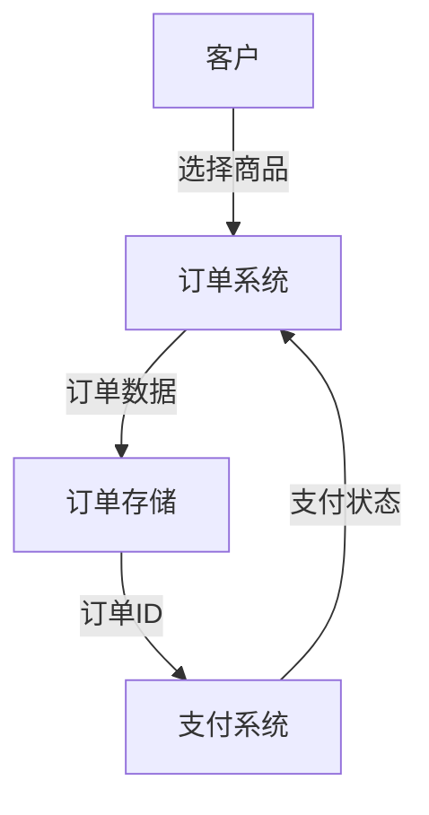
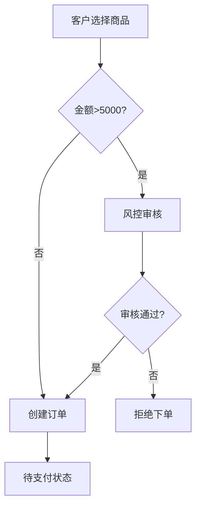
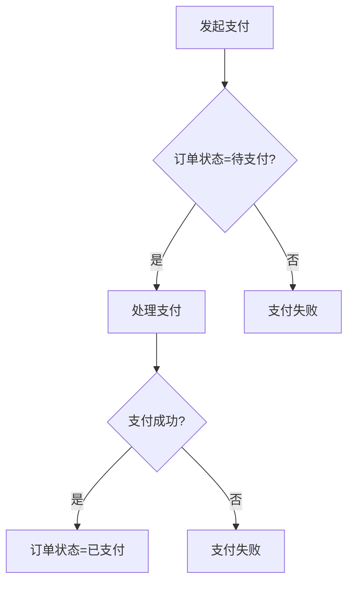
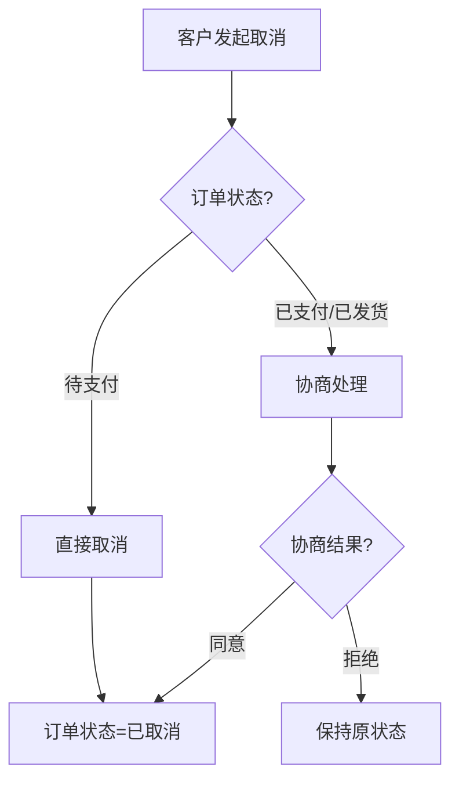

# 订单 领域模型

> 最后更新：{日期}

---

## 一、术语表

| 术语 | 英文名 | 定义 | 关联术语 |
|------|--------|------|----------|
| 订单 | Order | 客户购买商品的交易记录 | 客户、SKU、支付 |
| 客户 | Customer | 购买商品的用户 | 订单 |
| SKU | SKU | 商品库存单位 | 订单 |

---

## 二、实体定义

### 订单

| 属性 | 类型 | 必填 | 说明 |
|------|------|------|------|
| id | string | ✓ | 唯一标识 |
| customerId | string | ✓ | 客户ID |
| status | enum | ✓ | 订单状态 |
| amount | decimal | ✓ | 订单金额 |
| createdAt | datetime | ✓ | 创建时间 |

---

## 三、聚合边界

### 聚合：订单聚合

- 聚合根：订单
- 内部实体：订单项
- 值对象：收货地址

### 聚合间引用

| 聚合A | 聚合B | 引用方式 |
|-------|-------|----------|
| 订单聚合 | 客户聚合 | customerId |
| 订单聚合 | SKU聚合 | skuId |

---

## 四、状态机

### 状态定义

| 状态 | 编码 | 是否终态 | 说明 |
|------|------|----------|------|
| 待支付 | PENDING_PAYMENT | 否 | 订单已创建，等待支付 |
| 已支付 | PAID | 否 | 支付完成，等待发货 |
| 待发货 | PENDING_SHIPMENT | 否 | 等待供应商发货 |
| 已发货 | SHIPPED | 否 | 商品已发出 |
| 已完成 | COMPLETED | 是 | 用户已收货确认 |
| 已取消 | CANCELLED | 是 | 订单已取消 |

### 状态流转

| 当前状态 | 触发事件 | 目标状态 | 前置条件 |
|----------|----------|----------|----------|
| 待支付 | 支付成功 | 已支付 | 无欠款、无风控拦截 |
| 已支付 | 发货 | 待发货 | 库存充足 |
| 待发货 | 已发出 | 已发货 | 物流信息已填 |
| 已发货 | 确认收货 | 已完成 | 用户确认 |
| 待支付 | 取消 | 已取消 | 用户主动取消 |

### 异常流转

| 当前状态 | 异常场景 | 处理方式 | 目标状态 |
|----------|----------|----------|----------|
| 待支付 | 并发支付 | 幂等处理 | 已支付 |
| 已发货 | 用户取消 | 协商退款 | 已取消 |

---

## 五、业务规则

### 红线规则（不可绕过）

| 规则ID | 规则描述 | 来源 |
|--------|----------|------|
| R01 | 支付后才能发货 | 用户原话 |
| R02 | 发货后用户确认收货才算完成 | 用户原话 |
| R03 | 订单金额超过 5000 元需要风控审核 | 用户原话 |
| R04 | 同一用户不能有超过 3 个待支付订单 | 用户原话 |

### 业务规则

| 规则ID | 规则描述 | 来源 | 适用场景 |
|--------|----------|------|----------|
| R05 | 待支付时可以取消订单 | 用户原话 | 取消场景 |
| R06 | 已发货后可以申请退款 | 用户原话 | 退款场景 |

---

## 六、数据流图

### 订单创建数据流

| 数据流 | 数据内容 | 来源 | 目的地 |
|--------|----------|------|--------|
| 商品选择 | SKU列表、数量 | 客户 | 订单系统 |
| 订单数据 | 订单ID、金额、状态 | 订单系统 | 订单存储 |
| 支付请求 | 订单ID、金额 | 订单系统 | 支付系统 |

---

## 七、业务场景（用例）

### 场景：下单

**触发条件**：客户选择商品并确认购买

**参与者**：客户、业务员

**流程**：

**涉及实体**：订单、订单项、SKU

**状态变化**：无 → 待支付

**规则约束**：R03, R04

---

### 场景：支付

**触发条件**：客户完成支付

**参与者**：客户、支付系统

**流程**：

**涉及实体**：订单、支付记录

**状态变化**：待支付 → 已支付

**规则约束**：R01

---

### 场景：取消订单

**触发条件**：客户主动取消

**参与者**：客户、业务员

**流程**：

**涉及实体**：订单

**状态变化**：待支付 → 已取消

**规则约束**：R05

---

## 八、待定项

| # | 待定内容 | 来源 | 状态 |
|---|----------|------|------|
| 1 | 退款流程具体规则 | 用户原话 | 待确认 |
| 2 | 风控审核具体流程 | 用户原话 | 待确认 |