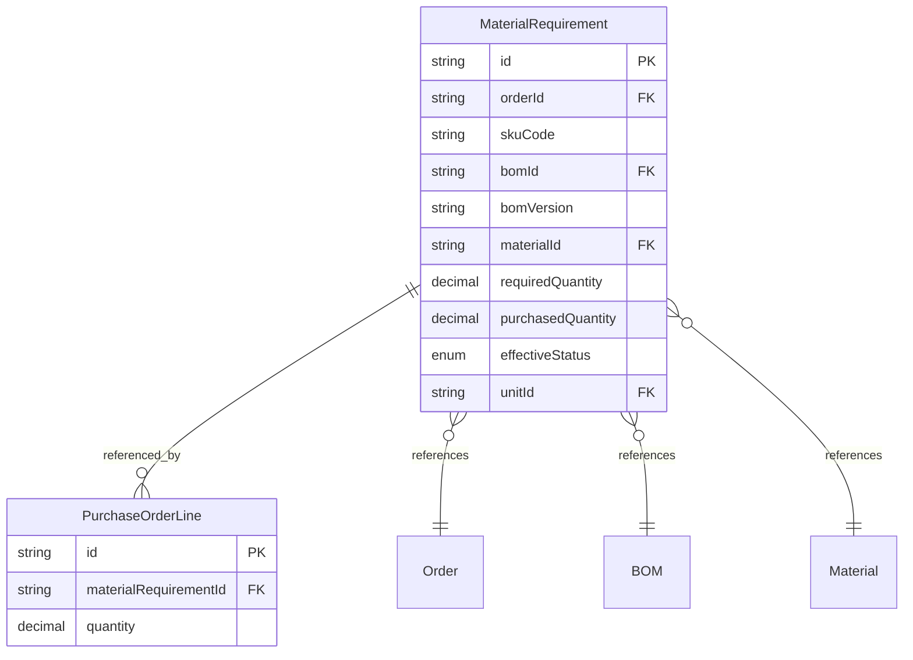
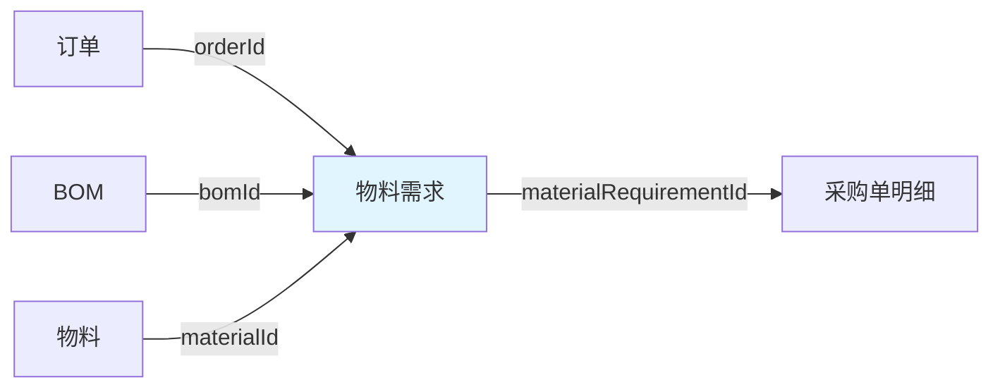

# 物料需求领域模型设计方案

> 设计日期：2026-04-21

---

## 用户原话

> "订单的sku x bom =物料需求，物料需求用来驱动采购，没有需求不允许采购
> 物料需求是通过bom的物料计算功能算出来的，计算之后则生效，但是bom可能变更，变更之后可能导致之前算出来的物料需求无效，但是如果已经采购了，则物料标记无效，不能删除，如果没采购直接就不需要了，可以删除"

---

## 1 领域词典

| 概念 | 是 | 不是 |
|------|------|------|
| 物料需求 | 订单SKU与BOM计算得出的采购驱动数据 | 采购订单、库存需求 |
| 生效状态 | 物料需求的可用性状态（ACTIVE/INVALID） | 采购状态 |
| 采购状态 | 物料需求的采购进度（通过采购数量判断） | 生效状态 |

---

## 2 状态流转

### 2.1 正交状态矩阵

| 生效状态 | 采购状态 | 允许操作 | 说明 |
|----------|----------|----------|------|
| ACTIVE | 未采购 | 创建采购单 | 正常状态，可采购 |
| ACTIVE | 部分采购 | 创建采购单 | 部分采购，继续采购 |
| ACTIVE | 已采购 | 无 | 采购完成 |
| INVALID | 未采购 | 删除 | BOM变更无效，未采购，可删除 |
| INVALID | 部分采购 | 标记无效 | BOM变更无效，部分采购，不能删除 |
| INVALID | 已采购 | 标记无效 | BOM变更无效，已采购，不能删除 |

### 2.2 生效状态流转

| 当前状态 | 触发条件 | 目标状态 | 副作用 | 禁止动作 | 禁止原因 |
|----------|----------|----------|----------|----------|----------|
| `ACTIVE` | BOM变更导致物料需求失效 | `INVALID` | 如果已采购，保留记录；如果未采购，可删除 | 采购 | 物料需求无效，不允许采购 |
| `INVALID`（终态） | - | - | - | 采购、修改 | 无效物料需求不可操作 |

### 2.3 采购状态流转（逻辑状态）

| 采购数量条件 | 采购状态 | 说明 |
|--------------|----------|------|
| purchasedQuantity = 0 | 未采购 | 未开始采购 |
| purchasedQuantity < requiredQuantity | 部分采购 | 部分采购完成 |
| purchasedQuantity >= requiredQuantity | 已采购 | 采购完成 |

---

## 3 实体定义

### 实体关系图

### 物料需求（聚合根）

| 属性 | 类型 | 必填 | 说明 |
|------|------|------|------|
| id | string | ✓ | 唯一标识 |
| orderId | string | ✓ | 订单ID |
| skuCode | string | ✓ | SKU编码 |
| bomId | string | ✓ | BOM ID |
| bomVersion | string | ✓ | BOM版本（用于跟踪BOM变更） |
| materialId | string | ✓ | 物料ID |
| requiredQuantity | decimal | ✓ | 需求数量 |
| purchasedQuantity | decimal | ✓ | 采购数量（累计，默认0） |
| effectiveStatus | enum | ✓ | 生效状态（ACTIVE/INVALID） |
| unitId | string | ✓ | 计量单位ID |
| createdAt | datetime | ✓ | 创建时间 |
| updatedAt | datetime | | 更新时间 |

---

## 4 业务规则

| 规则ID | 规则名 | WHEN | THEN | 约束 |
|--------|--------|------|------|------|
| R001 | 无需求禁止采购 | 创建采购单明细 | 校验物料需求 effectiveStatus = ACTIVE | 物料需求必须生效 |
| R002 | 物料需求计算生效 | 计算物料需求 | 设置 effectiveStatus = ACTIVE | 物料需求计算后生效 |
| R003 | BOM变更触发无效 | BOM变更导致物料需求失效 | 设置 effectiveStatus = INVALID | 需校验采购状态 |
| R004 | 无效物料需求删除条件 | 删除物料需求 | 校验 effectiveStatus = INVALID && purchasedQuantity = 0 | 未采购且无效才能删除 |
| R005 | 采购数量累加 | 创建/修改采购单明细 | 更新 purchasedQuantity = SUM(采购单明细数量) | 需乐观锁控制并发 |
| R006 | 物料需求不可修改 | 修改物料需求 | 禁止修改（只能通过BOM变更或采购行为触发） | 保证一致性 |

---

## 5 领域事件

| 事件名 | 携带数据 | 预期消费者 | 执行动作 |
|--------|----------|----------|----------|
| MaterialRequirementCreated | `materialRequirementId, orderId, materialId` | 采购模块 | 创建采购申请 |
| MaterialRequirementInvalidated | `materialRequirementId, purchasedQuantity` | 采购模块、财务模块 | 停止采购、财务处理 |
| PurchaseQuantityUpdated | `materialRequirementId, purchasedQuantity` | 生产模块 | 更新采购进度 |

---

## 6 聚合边界

| 聚合名 | 聚合根 | 内部实体 |
|--------|--------|----------|
| 物料需求聚合 | 物料需求 | 无（独立聚合根） |

---

## 7 上下游关系图

---

## 8 用例

| 用例 | 角色 | 操作 | 目标 |
|------|------|------|------|
| 计算物料需求 | 生产跟单员 | 根据订单SKU和BOM计算物料需求 | 生成物料需求清单 |
| 标记物料需求无效 | 生产跟单员 | BOM变更后标记物料需求无效 | 停止采购 |
| 删除无效物料需求 | 生产跟单员 | 删除未采购的无效物料需求 | 清理无效数据 |
| 查询物料需求 | 业务经理 | 查询物料需求列表 | 了解采购进度 |
| 创建采购单 | 采购员 | 基于物料需求创建采购单 | 执行采购 |

---

## 9 角色评审汇总

| 角色 | 核心建议 | 待定项 |
|------|----------|--------|
| 业务经理 | 物料需求拆分需审批 | 物料需求拆分审批流程 |
| 生产跟单员 | BOM变更触发条件说明 | 物料需求计算触发时机 |
| 系统架构师 | 采购数量更新需乐观锁、删除前置校验 | 无 |
| 财务主管 | 无效物料需求的财务处理 | 物料需求成本字段设计 |

---

## 10 待定任务

| # | 待定内容 | 来源 | 状态 |
|---|----------|------|------|
| 1 | 物料需求拆分审批流程 | 业务经理评审 | 待确认 |
| 2 | 物料需求计算触发时机 | 生产跟单员评审 | 待确认 |
| 3 | 无效物料需求的财务处理 | 财务主管评审 | 待确认 |
| 4 | 物料需求成本字段设计 | 财务主管评审 | 待确认 |
| 5 | BOM变更触发物料需求无效的具体条件 | 生产跟单员评审 | 待确认 |