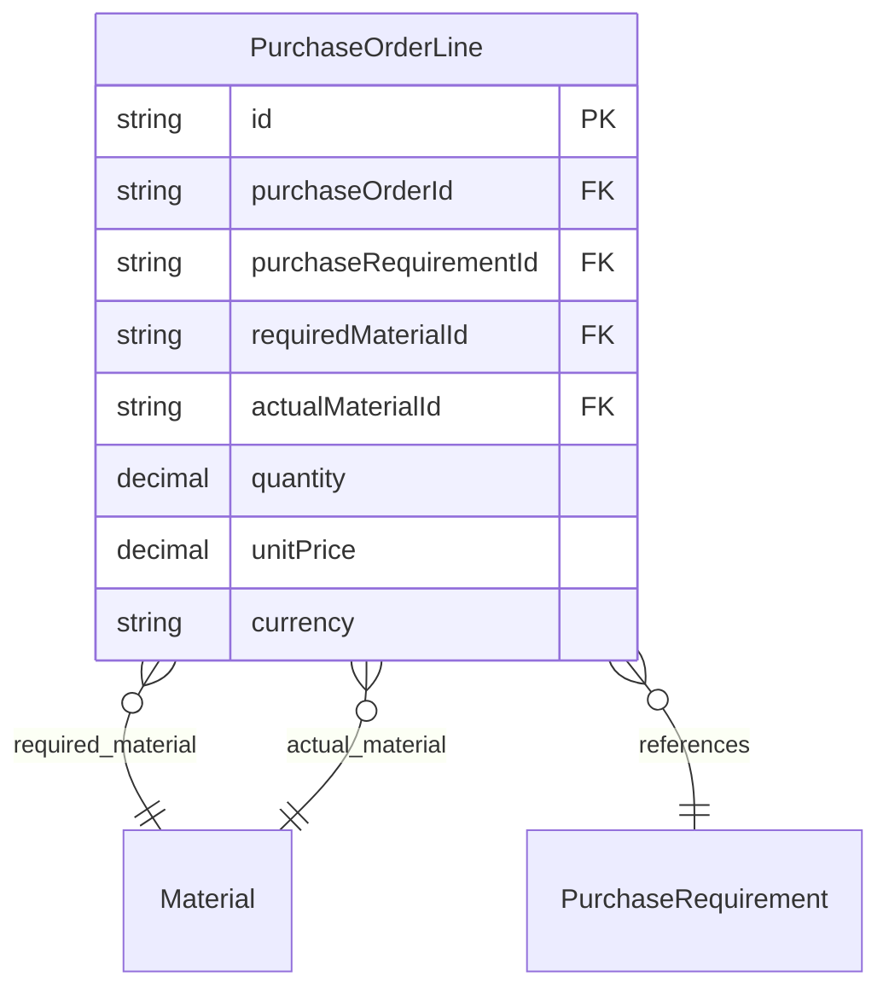

# 采购替代功能设计草稿

> 领域：procurement（采购）
> 来源：用户对话澄清
> 设计日期：2026-04-22

---

## 用户原话

> "用户在采购的时候，可能不按照bom采购用其他物料来满足这个采购需求"
> "替代料就是替代了bom的需求物料，跟原来的计算逻辑不发生影响，就当作bom要的我买别的这事允许就行"
> "管理部说他们关心：采购单可以看出原来需要什么，实际采购了什么这个差异"

---

## 澄清记录

| 问题 | 答案 |
|------|------|
| 替代关系建立方式 | 人工指定，无审批 |
| 审批流程 | 不需要审批 |
| 合同中如何体现替代 | 合同按实际采购物料生成 |
| 替代后库存扣减 | 按实际采购物料入库/库存，与需求物料无关 |
| 替代关系记录 | 需要记录（采购单显示差异） |
| 采购数量累加规则 | 替代采购数量仍累加到原采购需求的采购数量 |
| 管理部报表 | 不需要，直接看采购单明细 |

---

## 设计内容

### 1 领域词典（补充）

| 概念 | 是 | 不是 |
|------|------|------|
| 需求物料 | 采购需求指定的物料（BOM计算得出） | 实际采购物料 |
| 实际采购物料 | 采购员实际采购的物料 | 需求物料 |
| 替代采购 | 实际采购物料 ≠ 求求物料 | 违规采购 |
| 差异标识 | 标记采购明细是否存在替代 | 状态字段 |

---

### 2 实体定义（采购单明细补充）

#### 采购单明细属性变更

| 属性 | 类型 | 必填 | 说明 | 变更 |
|------|------|------|------|------|
| id | string | ✓ | 唯一标识 | - |
| purchaseOrderId | string | ✓ | 采购单ID | - |
| purchaseRequirementId | string | ✓ | 采购需求ID | - |
| requiredMaterialId | string | ✓ | 需求物料ID（来源于采购需求） | 新增 |
| actualMaterialId | string | ✓ | 实际采购物料ID（采购员选择） | 新增 |
| quantity | decimal | ✓ | 采购数量 | - |
| unitPrice | decimal | ✓ | 单价 | - |
| currency | string | ✓ | 币种 | - |

#### 实体关系图（补充）



---

### 3 业务规则（补充）

| 规则ID | 规则名 | WHEN | THEN | 约束 |
|--------|--------|------|------|------|
| R010 | 需求物料自动带入 | 创建采购单明细 | requiredMaterialId = purchaseRequirement.materialId | 需求物料只读，不可修改 |
| R011 | 实际物料默认需求 | 创建采购单明细 | IF actualMaterialId 未选择 THEN actualMaterialId = requiredMaterialId | 默认采购需求物料 |
| R012 | 替代采购弱提示 | actualMaterialId ≠ requiredMaterialId | 显示提示："采购物料与需求物料不同" | 不阻断，仅提示 |
| R013 | 采购数量累加到需求 | 采购单明细确认 | 更新 purchaseRequirement.purchasedQuantity | 按采购需求ID累加，不按物料ID |
| R014 | 合同按实际物料生成 | 生成合同 | 合同明细按 actualMaterialId 生成 | 合同反映实际采购 |
| R015 | 入库按实际物料 | 入库登记 | 入库物料 = actualMaterialId | 库存按实际物料计算 |

---

### 4 差异标识（计算规则）

| 条件 | 差异标识 | 显示 |
|------|----------|------|
| actualMaterialId = requiredMaterialId | 正常 | 无标识 |
| actualMaterialId ≠ requiredMaterialId | ✓替代 | 显示"替代采购" |

**说明**：差异标识为计算字段，不存储，采购单查询时实时计算。

---

### 5 采购单明细展示（管理部视角）

| 需求物料 | 实际采购物料 | 数量 | 差异标识 |
|----------|-------------|------|----------|
| 物料A | 物料A | 100 | - |
| 物料B | 物料C | 50 | ✓替代 |
| 物料D | 物料D | 200 | - |

**说明**：管理部可直接查看采购单明细，了解替代采购情况。

---

### 6 完整链路（修订版）

```
┌─────────────────────────────────────────────────────────────┐
│                        需求产生                              │
│  BOM计划 → 采购需求（物料A，数量N）                           │
└─────────────────────────────────────────────────────────────┘
                              ↓
┌─────────────────────────────────────────────────────────────┐
│                        采购下单                              │
│  采购员创建采购单明细：                                       │
│    - 需求物料：A（系统自动带出，只读）                        │
│    - 实际采购物料：B（采购员选择，允许替代）                   │
│    - 弱提示：选择非需求物料时显示提示                         │
│    - 无审批流程                                              │
└─────────────────────────────────────────────────────────────┘
                              ↓
┌─────────────────────────────────────────────────────────────┐
│                      采购单明细                              │
│  | 需求物料 | 实际采购物料 | 数量 | 差异标识 |                │
│  | 物料A    | 物料B       | 100  | ✓替代   |                 │
│  管理部可直接查看                                            │
└─────────────────────────────────────────────────────────────┘
                              ↓
┌─────────────────────────────────────────────────────────────┐
│                        合同生成                              │
│  按实际采购物料（B）生成合同                                  │
│  可追溯采购单，间接查看差异                                   │
└─────────────────────────────────────────────────────────────┘
                              ↓
┌─────────────────────────────────────────────────────────────┐
│                        后续处理                              │
│  采购数量累加：累加到采购需求（按 purchaseRequirementId）     │
│  入库/库存：按实际物料B计算                                   │
└─────────────────────────────────────────────────────────────┘
```

---

### 7 领域事件（补充）

| 事件名 | 携带数据 | 预期消费者 | 执行动作 |
|--------|----------|----------|----------|
| SubstitutePurchaseCreated | `purchaseOrderLineId, requiredMaterialId, actualMaterialId` | 无（仅记录） | 无需后续动作 |

---

### 8 自检清单执行

| 序号 | 检查项 | 结果 |
|------|--------|------|
| 1 | `[状态正交]` | ✓ 不涉及新状态，采购单状态已有四维度正交 |
| 2 | `[属性除冗]` | ✓ 差异标识为计算字段，不存储；requiredMaterialId 来源于采购需求，只读 |
| 3 | `[规则纯度]` | ✓ 弱提示规则只返回提示，不修改状态；累加动作在事件中 |
| 4 | `[事件过去时]` | ✓ 事件命名为过去时格式 |
| 5 | `[边界隔离]` | ✓ 采购数量累加通过 purchaseRequirementId，不跨界协同 |

---

### 9 待定任务

| # | 待定内容 | 来源 | 状态 |
|---|----------|------|------|
| 1 | 替代采购统计报表（是否需要） | 用户已确认不需要 | 已解决 |

---

## 附录：与现有设计的整合说明

### 采购单明细变更

现有采购单明细属性：
- purchaseRequirementId
- quantity
- unitPrice
- currency

新增属性：
- requiredMaterialId（需求物料ID，来源于采购需求）
- actualMaterialId（实际采购物料ID，采购员选择）

### 业务规则变更

现有规则 R003：
> 采购数量上限：quantity <= purchaseRequirement.requiredQuantity - purchaseRequirement.purchasedQuantity

不变，因为采购数量仍按采购需求ID累加。

### 合同生成变更

现有规则 R005：
> 合同金额计算：contractAmount = SUM(line.quantity × line.unitPrice)

不变，合同明细按 actualMaterialId 生成。