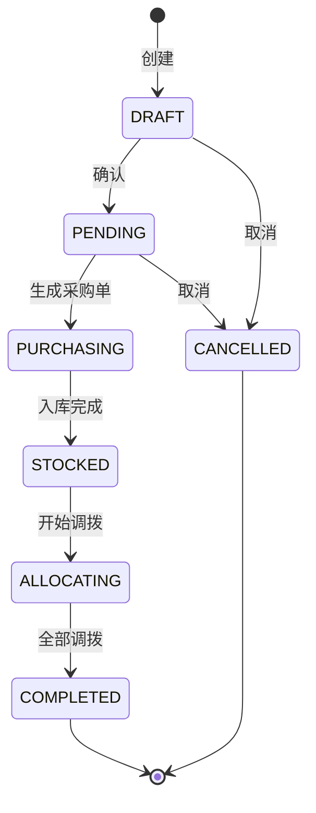
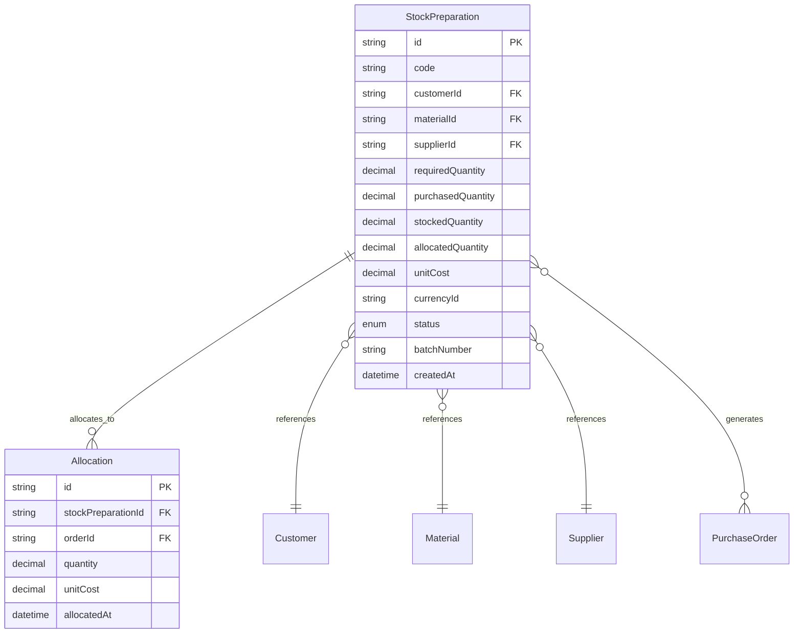
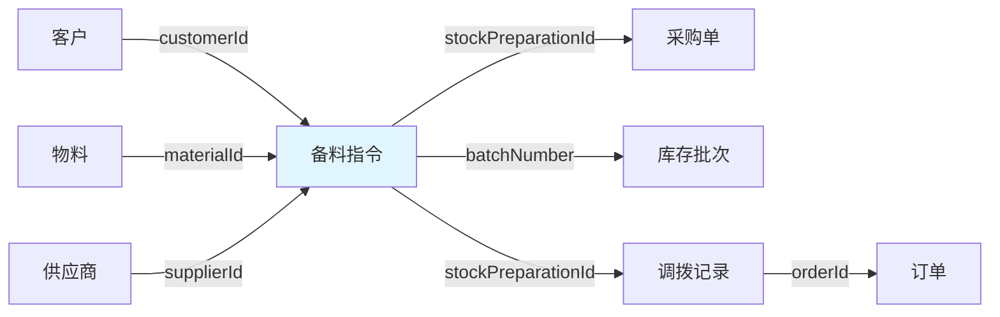

# 备料指令领域模型设计方案

> 设计日期：2026-04-21

---

## 用户原话

> "国外客户给我们下备料指令了"
> "没有他们就直接告诉我们什么东西去哪买多少就"
> "未来会下订单，下来订单之后我们再调拨这些物料到订单上"
> "需要纳入系统，因为要采购"

---

## 1 领域词典

| 概念 | 是 | 不是 |
|------|------|------|
| 备料指令 | 客户下发的采购指令，指定物料、数量、供应商 | 采购订单、物料需求 |
| 采购需求 | 驱动采购的需求数据（来源：订单计算或备料指令） | 采购订单 |
| 来源类型 | 采购需求的来源（ORDER_BASED / PREPARATION_BASED） | 状态 |

---

## 2 状态流转

### 备料指令状态

| 当前状态 | 触发条件 | 目标状态 | 副作用 | 禁止动作 | 禁止原因 |
|----------|----------|----------|----------|----------|----------|
| `DRAFT` | 创建备料指令 | `PENDING` | 生成采购需求 | 无 | 初始状态 |
| `PENDING` | 生成采购单 | `PURCHASING` | 更新采购需求状态 | 直接调拨 | 未采购不能调拨 |
| `PURCHASING` | 物料入库完成 | `STOCKED` | 更新入库数量 | 直接完成 | 需全部入库 |
| `STOCKED` | 开始调拨 | `ALLOCATING` | 更新调拨数量 | 取消 | 已入库不能取消 |
| `ALLOCATING` | 全部调拨完成 | `COMPLETED` | 清空库存批次标记 | 取消 | 已调拨不能取消 |
| `DRAFT` / `PENDING` | 客户取消 | `CANCELLED` | 已入库物料转为通用库存 | 采购、调拨 | 已取消不能操作 |
| `COMPLETED`（终态） | - | - | - | 所有操作 | 终态不可变更 |
| `CANCELLED`（终态） | - | - | - | 所有操作 | 终态不可变更 |

### 状态图

---

## 3 实体定义

### 实体关系图

### 备料指令（聚合根）

| 属性 | 类型 | 必填 | 说明 |
|------|------|------|------|
| id | string | ✓ | 唯一标识 |
| code | string | ✓ | 备料指令编号 |
| customerId | string | ✓ | 客户ID |
| materialId | string | ✓ | 物料ID |
| supplierId | string | ✓ | 供应商ID（客户指定） |
| requiredQuantity | decimal | ✓ | 需求数量 |
| purchasedQuantity | decimal | ✓ | 已采购数量（默认0） |
| stockedQuantity | decimal | ✓ | 已入库数量（默认0） |
| allocatedQuantity | decimal | ✓ | 已调拨数量（默认0） |
| unitCost | decimal | | 采购单价（成本） |
| currencyId | string | | 采购币种 |
| status | enum | ✓ | 状态（DRAFT/PENDING/PURCHASING/STOCKED/ALLOCATING/COMPLETED/CANCELLED） |
| batchNumber | string | | 入库批次号（用于标记库存归属） |
| createdAt | datetime | ✓ | 创建时间 |
| updatedAt | datetime | | 更新时间 |

---

## 4 业务规则

| 规则ID | 规则名 | WHEN | THEN | 约束 |
|--------|--------|------|------|------|
| R001 | 客户指定供应商 | 创建备料指令 | supplierId 必填 | 供应商由客户指定 |
| R002 | 采购数量累加 | 创建/修改采购单明细 | 更新 purchasedQuantity | 需乐观锁控制并发 |
| R003 | 入库数量累加 | 物料入库 | 更新 stockedQuantity，生成 batchNumber | 入库时标记批次号 |
| R004 | 调拨数量累加 | 调拨到订单 | 更新 allocatedQuantity | 需乐观锁控制并发 |
| R005 | 调拨成本带入 | 调拨到订单 | Allocation.unitCost = StockPreparation.unitCost | 成本追溯 |
| R006 | 取消时库存处理 | 取消备料指令 | 已入库物料转为通用库存（清空 batchNumber） | 仅 DRAFT/PENDING 状态可取消 |
| R007 | 部分调拨允许 | 调拨到订单 | allocatedQuantity < stockedQuantity | 可多次调拨 |
| R008 | 全部调拨完成 | 全部调拨完成 | status = COMPLETED | allocatedQuantity = requiredQuantity |

### 不变式

| 不变式ID | 不变式名 | 约束条件 | 防止场景 |
|----------|----------|----------|----------|
| I001 | 数量一致性 | purchasedQuantity >= stockedQuantity >= allocatedQuantity | 防止数据不一致 |
| I002 | 调拨不超过入库 | allocatedQuantity <= stockedQuantity | 防止超额调拨 |
| I003 | 取消状态限制 | status = DRAFT 或 PENDING 才能取消 | 防止已入库/已调拨被取消 |

---

## 5 领域事件

| 事件名 | 携带数据 | 预期消费者 | 执行动作 |
|--------|----------|----------|----------|
| StockPreparationCreated | `stockPreparationId, customerId, materialId, requiredQuantity` | 采购模块 | 生成采购申请 |
| StockPreparationCancelled | `stockPreparationId, stockedQuantity, batchNumber` | 库存模块 | 清空批次号，转为通用库存 |
| StockPreparationAllocated | `stockPreparationId, orderId, quantity, unitCost` | 订单模块 | 订单物料成本更新 |
| StockPreparationCompleted | `stockPreparationId` | 客户模块 | 通知客户备料完成 |

---

## 6 聚合边界

| 聚合名 | 联合根 | 内部实体 |
|--------|--------|----------|
| 备料指令聚合 | 备料指令 | 调拨记录（Allocation） |

---

## 7 上下游关系图

---

## 8 用例

| 用例 | 角色 | 操作 | 目标 |
|------|------|------|------|
| 创建备料指令 | 业务经理 | 接收客户备料指令，录入系统 | 生成采购需求 |
| 取消备料指令 | 业务经理 | 客户取消备料指令 | 停止采购，库存转为通用 |
| 查询备料指令状态 | 业务经理 | 查询备料指令进度 | 了解采购/入库/调拨状态 |
| 调拨物料到订单 | 业务经理 | 订单来时，从备料指令库存调拨 | 物料分配到订单 |
| 查询备料指令成本 | 财务主管 | 查询采购成本 | 成本核算 |

---

## 9 角色评审汇总

| 角色 | 核心建议 | 待定项 |
|------|----------|--------|
| 业务经理 | 取消时库存处理需明确（已确认：转为通用库存） | 无 |
| 财务主管 | 成本记录需明确（已确认：记录成本，调拨带入订单） | 多币种采购的汇率处理 |
| 系统架构师 | 与物料需求统一为采购需求模型（已确认：统一模型） | 备料指令编号生成规则 |

---

## 10 待定任务

| # | 待定内容 | 来源 | 状态 |
|---|----------|------|------|
| 1 | 备料指令编号生成规则 | 系统架构师评审 | 待确认 |
| 2 | 多币种采购的汇率处理 | 财务主管评审 | 待确认 |
| 3 | 与物料需求统一为采购需求模型的具体实现方案 | 系统架构师评审 | 待确认 |

---

## 11 重要决策：与物料需求统一模型

> 用户决策：备料指令与物料需求统一为"采购需求"模型

这意味着：
- 采购需求（PurchaseRequirement）有两种来源类型：
  - `ORDER_BASED`：订单SKU × BOM 计算（原物料需求）
  - `PREPARATION_BASED`：备料指令（客户手动指定）
- 原 `design/domain/material-requirement.md` 需要扩展为统一的采购需求模型

**下一步建议**：
- 使用 `/m-apply` 应用备料指令草稿
- 同时更新 `material-requirement.md` 为统一的采购需求模型